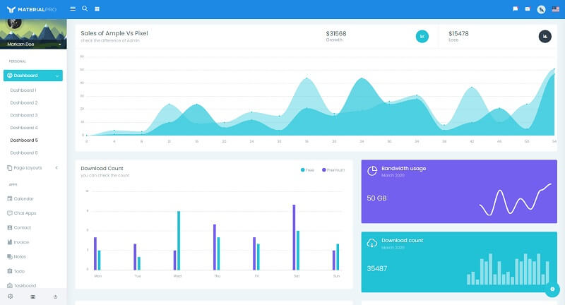

# Django MaterialPro

WrapPixel’s **MaterialPro Bootstrap Admin** is a premium bootstrap material design template that comes packed with new, fresh, and attractive designs and ready-to-use components. 

> Features

* Codebase - [Django Dashboard Boilerplate](../../boilerplate-code/django-dashboard.md)
* UI Kit: [MaterialPro](../../content/bootstrap-template/materialpro-wpx.md) \(premium version\) 
* SQLite Database, Django Native ORM
* Session-Based Authentication, Forms validation
* Deployment scripts: Docker, Gunicorn/Nginx 

> Links

* [MaterialPro Django](https://appseed.us/admin-dashboards/django-material-dashboard-wpx-pro) - product page
* [MaterialPro Django](https://github.com/app-generator/django-material-wpx-pro) - public repository used for tracking issues  
* [MaterialPro Django](https://django-material-wpx-pro.appseed-srv1.com/) - LIVE Demo
* [Support](https://appseed.us/support):  via **Github** \(issues tracker\) and [Discord](https://discord.gg/fZC6hup) - 24/7 LIVE Assistance. 

### How to use the App

* [Set up the environment](../../boilerplate-code/django-dashboard.md#environment-1) - prepare your workstation
* [Compile the sources](../../boilerplate-code/django-dashboard.md#build-the-app-1) - start the app in the local environment
* [App Codebase](../../boilerplate-code/django-dashboard.md#app-codebase) - how the files are organized
* [App Configuration](../../boilerplate-code/django-dashboard.md#app-configuration) - how to configure the application

### [MaterialPro WrapPixel](../../content/bootstrap-template/materialpro-wpx.md) - UI Kit

**Material Pro** Bootstrap Admin dashboard is versatile, user-friendly and has a clean code structure that optimizes the development cost and time. The smoothness and efficiency in using a customizable admin dashboard are felt with the reliable design inspiration by Google’s material design.

* [MaterialPro Wpx](../../content/bootstrap-template/materialpro-wpx.md) - information provided by AppSeed
* [MaterialPro Wpx](https://bit.ly/2NRHoFb) - product page hosted by [WrapPixel](../../content/partners/wrappixel.md). 

