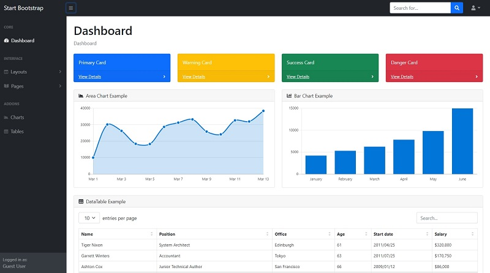

# Django SB Admin

**SB Admin** is a beautifully designed admin template featuring a fine selection of useful Bootstrap components and elements. This Dashboard is coming with pre-built examples, so the development process is seamless, switching from our pages to the real website is very easy to be done.&#x20;

> Features

* Codebase - [Django Dashboard Boilerplate](../../boilerplate-code/django-dashboard.md)
* UI Kit: **SB Admin** (free version) &#x20;
* SQLite Database, Django Native ORM
* Session-Based Authentication, Forms validation
* Deployment scripts: Docker, Gunicorn/Nginx&#x20;

> Links

* [SB Admin Django](https://appseed.us/admin-dashboards/django-dashboard-sb-admin) - product page
* [SB Admin Django](https://github.com/app-generator/django-dashboard-sb-admin) - source code
* [SB Admin Django](https://django-sb-admin.appseed-srv1.com) - LIVE Demo&#x20;

> [Support](https://appseed.us/support) (Email and LIVE on Discord) for **registered** [**AppSeed**](https://appseed.us) **users**.

###

### What is Django

Django is a high-level Python Web framework that encourages rapid development and clean, pragmatic design. Built by experienced developers, it takes care of much of the hassle of Web development, so you can focus on writing your app without needing to reinvent the wheel. It’s free and open source.

> Read more about [Django Framework](../../content/what-is/django.md)

### How to use the App

* [Set up the environment](../../boilerplate-code/django-dashboard.md#environment-1) - prepare your workstation for **Django**
* [Compile the sources](../../boilerplate-code/django-dashboard.md#build-the-app-1) - start this **Django** app in the local environment
* [App Codebase](../../boilerplate-code/django-dashboard.md#app-codebase) - how the project files are organized
* [App Configuration](../../boilerplate-code/django-dashboard.md#app-configuration) - how to configure this **Django** application

### SB Admin UI

**SB Admin** is a free, open-source, Bootstrap 4 based admin theme perfect for quickly creating dashboards and web applications. It's modern design style with subtle shadows and a card-based layout could be described as flat material and is inspired by the principles of material design along with a simple, attractive color system.

* [SB Admin](https://startbootstrap.com/template/sb-admin) - product page
* [SB Admin](https://github.com/startbootstrap/startbootstrap-sb-admin) - source code (Github)

