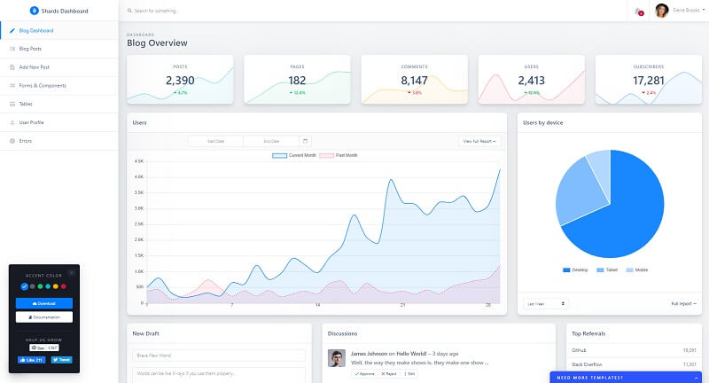

# Django Shards Dashboard

A high-quality & free Bootstrap admin dashboard template pack that comes with lots of templates and components. Based on Bootstrap 4, **Shards Dashboard Lite** is fully responsive and capable to adapt its layout to any viewport size.

## [Black Friday](https://appseed.us/discounts/) - `75%OFF`

> The [campaign](https://appseed.us/discounts/)  is active until `30.NOV` and applies to all products and licenses.

<figure><figcaption>
Black Friday - 75%OFF 
</figcaption></figure>

> Features

* Codebase - [Django Dashboard Boilerplate](../../boilerplate-code/django-dashboard.md)
* UI Kit: Shards Dashboard (free version) provided by DesignRevision 
* SQLite Database, Django Native ORM
* Session-Based Authentication, Forms validation
* Deployment scripts: Docker, Gunicorn/Nginx

> Links

* [Shards Django](https://appseed.us/admin-dashboards/django-dashboard-shards) - product page
* [Shards Django](https://github.com/app-generator/django-dashboard-shards) - source code
* [Shards Django](https://django-dashboard-shards.appseed.us/) - LIVE Demo

> [Support](https://appseed.us/support) (Email and LIVE on Discord) for **registered** [**AppSeed**](https://appseed.us/) **users**.

### What is Django

Django is a high-level Python Web framework that encourages rapid development and clean, pragmatic design. Built by experienced developers, it takes care of much of the hassle of Web development, so you can focus on writing your app without needing to reinvent the wheel. It’s free and open source.

> Read more about [Django Framework](../../content/what-is/django.md)

### How to use the App

* [Set up the environment](../../boilerplate-code/django-dashboard.md#environment-1) - prepare your workstation for **Django**
* [Compile the sources](../../boilerplate-code/django-dashboard.md#build-the-app-1) - start this **Django** app in the local environment
* [App Codebase](../../boilerplate-code/django-dashboard.md#app-codebase) - how the project files are organized
* [App Configuration](../../boilerplate-code/django-dashboard.md#app-configuration) - how to configure this **Django** application

### Shards Dashboard UI

A high-quality & free Bootstrap admin dashboard template pack that comes with lots of templates and components. Based on Bootstrap 4, **Shards Dashboard Lite** is fully responsive and capable to adapt its layout to any viewport size.

* [Shards Dashboard](../../content/bootstrap-template/shards-dashboard.md) - information provided by AppSeed
* [Shards Dashboard](https://designrevision.com/downloads/shards-dashboard-lite/) - product page hosted by DesignRevision

