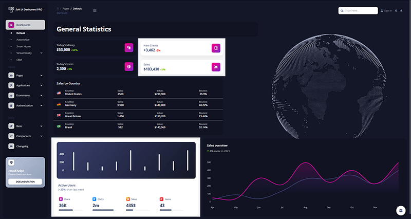

# Django Soft Dashboard PRO

Made of hundred of elements, designed blocks, and fully coded pages, [**Soft UI Dashboard PRO**](https://appseed.us/product/django-soft-ui-dashboard-pro) is ready to help you create stunning websites and web apps. `Soft UI Dashboard PRO` is built with over 300 frontend individual elements, like buttons, inputs, navbars, nav tabs, cards, or alerts, giving you the freedom of choosing and combining.

> Features&#x20;

* `Up-to-date dependencies`: **Django 3.2.6 LTS**
* SCSS compilation via **Gulp**
* UI Kit: [**Soft UI Dashboard**](https://bit.ly/2RtSXVa) (PRO Version) provided by **Creative-Tim**
* SQLite Database, Django Native ORM
* Modular design, clean codebase
* Session-Based Authentication, Forms validation
* `Deployment`: **Docker**, Gunicorn / Nginx

> Links&#x20;

* [Soft Dashboard PRO Django](https://appseed.us/product/django-soft-ui-dashboard-pro) - Product Page
* [Soft Dashboard PRO Django](https://django-soft-ui-dashboard-pro.appseed-srv1.com) - LIVE Demo&#x20;

### What is Django

Django is a high-level Python Web framework that encourages rapid development and clean, pragmatic design. Built by experienced developers, it takes care of much of the hassle of Web development, so you can focus on writing your app without needing to reinvent the wheel. It’s free and open source.

> Read more about [Django Framework](../../content/what-is/django.md)

### How to use the App

* [Set up the environment](../../boilerplate-code/django-dashboard.md#environment) - prepare your workstation for **Django**
* [Compile the sources](../../boilerplate-code/django-dashboard.md#build-the-app) - start this **Django** app in the local environment
* [App Codebase](../../boilerplate-code/django-dashboard.md#app-codebase) - how the project files are organized
* [App Configuration](../../boilerplate-code/django-dashboard.md#app-configuration) - how to configure this **Django** application
* [Recompile SCSS](../../boilerplate-code/django-dashboard.md#recompile-css) - update CSS files (tooling via Gulp)

### Soft Dashboard UI PRO

Premium Bootstrap 5 dashboard designed by `Creative-Tim`.  This Premium Bootstrap 5 Dashboard is coming with prebuilt design blocks, so the development process is seamless, switching from our pages to the real website is very easy to be done.&#x20;

* [Soft Dashboard UI PRO](https://www.creative-tim.com/product/soft-ui-dashboard-pro?AFFILIATE=128200) - Bootstrap5 version
* [Soft Dashboard UI PRO](https://demos.creative-tim.com/soft-ui-dashboard-pro/pages/dashboards/default.html?AFFILIATE=128200) - LIVE Demo

