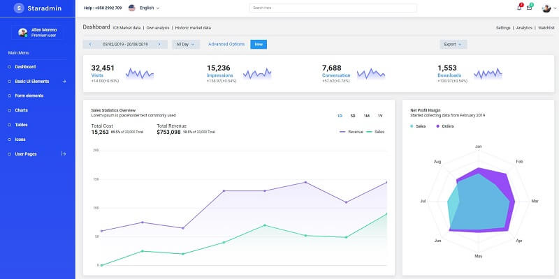

# Django Star Admin

**Star Admin** is a free responsive admin template built with Bootstrap 4. The template has a colorful, attractive yet simple and elegant design. The template is well crafted, with all the components neatly and carefully designed and arranged within the template.&#x20;

> Features

* Codebase - [Django Dashboard Boilerplate](../../boilerplate-code/django-dashboard.md)
* UI Kit: [Star Admin](../../content/bootstrap-template/star-admin.md) (free version) &#x20;
* SQLite Database, Django Native ORM
* Session-Based Authentication, Forms validation
* Deployment scripts: Docker, Gunicorn/Nginx&#x20;

> Links&#x20;

* [Star Admin Django](https://appseed.us/admin-dashboards/django-star-admin) - product page
* [Star Admin Django](https://github.com/app-generator/django-star-admin) - source code&#x20;
* [Star Admin Django](https://django-star-admin.appseed-srv1.com/) - LIVE Demo&#x20;

> [Support](https://appseed.us/support) (Email and LIVE on Discord) for **registered** [**AppSeed**](https://appseed.us/) **users**.

### What is Django

Django is a high-level Python Web framework that encourages rapid development and clean, pragmatic design. Built by experienced developers, it takes care of much of the hassle of Web development, so you can focus on writing your app without needing to reinvent the wheel. It’s free and open source.

> Read more about [Django Framework](../../content/what-is/django.md)

### How to use the App

* [Set up the environment](../../boilerplate-code/django-dashboard.md#environment-1) - prepare your workstation for **Django**
* [Compile the sources](../../boilerplate-code/django-dashboard.md#build-the-app-1) - start this **Django** app in the local environment
* [App Codebase](../../boilerplate-code/django-dashboard.md#app-codebase) - how the project files are organized
* [App Configuration](../../boilerplate-code/django-dashboard.md#app-configuration) - how to configure this **Django** application

### Star Admin - UI Kit&#x20;

Star Admin is packed with all the features that fit your needs but not cramped with components you would not even use. It is an excellent fit to build admin panels, e-commerce systems, project management systems, CMS or CRM.

* [Star Admin](../../content/bootstrap-template/star-admin.md) - information provided by AppSeed
* [Star Admin](https://bit.ly/2VXUgKu) - product page hosted by [BootstrapDash](../../content/partners/bootstrapdash.md)

