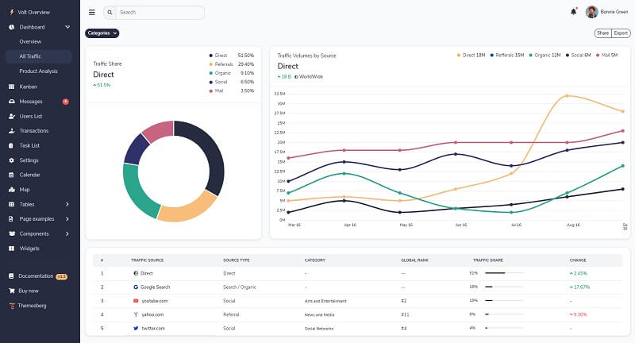

# Volt PRO Django

Volt Pro is a premium Bootstrap 5 Admin Dashboard featuring over 800 components, 20 example pages, and 10 fully customized plugins written in Vanilla Javascript. There are more than 800 premium Bootstrap 5 components included with the admin dashboard, some of which are buttons, forms, alerts, date pickers, range sliders, and many more.  

> Features

* Codebase - [Django Dashboard Boilerplate](../../boilerplate-code/django-dashboard.md)
* UI Kit: Volt PRO Dashboard \(premium version\)  
* SQLite Database, Django Native ORM
* Session-Based Authentication, Forms validation
* Deployment scripts: Docker, Gunicorn/Nginx 

> Links

* [Volt PRO Django](https://appseed.us/admin-dashboards/django-dashboard-volt-pro) - product page
* [Volt PRO Django](https://github.com/app-generator/django-dashboard-volt-pro) - source code 
* [Volt PRO Django](https://django-volt-pro.appseed-srv1.com/) - LIVE Deployment
* [Support](https://appseed.us/support):  via **Github** \(issues tracker\) and [Discord](https://discord.gg/fZC6hup) - 24/7 LIVE Assistance. 

### How to use the App

* [Set up the environment](../../boilerplate-code/django-dashboard.md#environment-1) - prepare your workstation
* [Compile the sources](../../boilerplate-code/django-dashboard.md#build-the-app-1) - start the app in the local environment
* [App Codebase](../../boilerplate-code/django-dashboard.md#app-codebase) - how the files are organized
* [App Configuration](../../boilerplate-code/django-dashboard.md#app-configuration) - how to configure the application

### [Volt PRO](../../content/bootstrap-template/volt-dashboard-pro.md) - UI Kit

Volt Pro comes with 20 example pages including the overview page, kanban drag and drop page, messages, user settings, transactions, calendar, sign in, sign up, and many more pages. 

There are at least 10 lightweight Vanilla JS plugin libraries that we have customized and expanded in terms of features that you can use for your application. Some of these are a calendar, SVG maps, date pickers, notifications, drag and drop file uploads. 

* [Volt PRO](../../content/bootstrap-template/volt-dashboard-pro.md) - more information provided by AppSeed
* [Volt Dashboard Pro](https://themesberg.com/product/admin-dashboard/volt-premium-bootstrap-5-dashboard) - product page hosted by [Themesberg](../../content/partners/themesberg.md)

