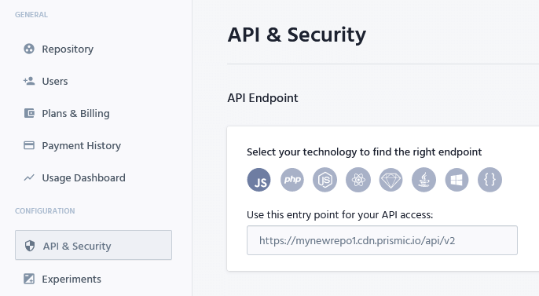
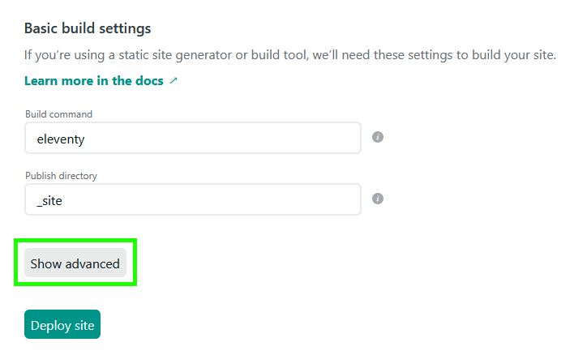
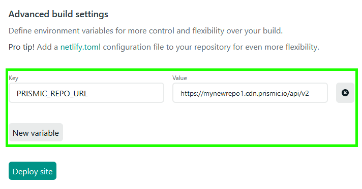
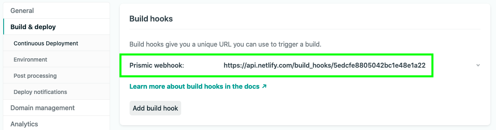
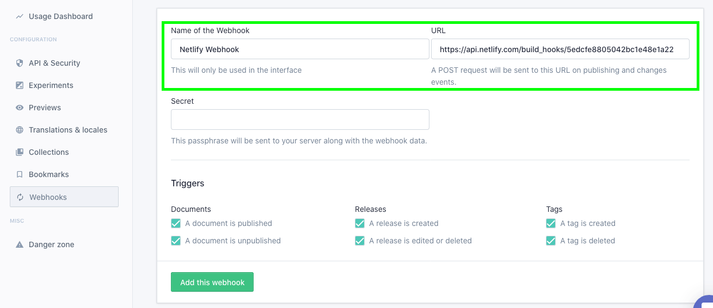

# Soft UI Design

Eleventy Soft is an Eleventy adaptation of Soft UI Design System (a user-friendly and beautiful design system based on Bootstrap 5), including a Blog system that uses Prismic CMS for content management.

Soft UI Design System is built with over 70 frontend individual elements, like buttons, inputs, navbars, nav tabs, cards, or alerts, giving you the freedom of choosing and combining. All components can take variations in color, which you can easily modify using SASS files and classes.

You will save a lot of time going from prototyping to full-functional code because all elements are implemented. This Freebie Bootstrap 5 UI Kit is coming with prebuilt design blocks, so the development process is seamless, switching from our pages to the real website is very easy to be done.


## [Black Friday](https://appseed.us/discounts/) - `75%OFF`

> The [campaign](https://appseed.us/discounts/)  is active until `30.NOV` and applies to all products and licenses.

<figure><figcaption><p>Black Friday - 75%OFF </p></figcaption></figure>


### Quick Start

This project uses includes a Blog system that uses Prismic CMS. You'll need a free [prismic.io](http://prismic.io/) account.

### Setup Prismic CMS

* In your Prismic account, create a new repository.
* In your repository, create a repeatable custom type called Blog Posts with API ID "blogposts".
*   To configure the content model for Blog Posts, paste this code in the JSON editor of the Blog Posts content type.

    ```
    {
      "Main": {
        "title": {
          "type": "StructuredText",
          "config": {
            "single": "heading1, heading2, heading3, heading4, heading5, heading6",
            "label": "title",
            "placeholder": "Title of the article"
          }
        },
        "uid": {
          "type": "UID",
          "config": {
            "label": "uid",
            "placeholder": "ID of the article"
          }
        },
        "date": {
          "type": "Date",
          "config": {
            "label": "date",
            "placeholder": "Created date of the article"
          }
        },
        "article_image": {
          "type": "Image",
          "config": {
            "constraint": {},
            "thumbnails": [],
            "label": "article_image"
          }
        },
        "body": {
          "type": "StructuredText",
          "config": {
            "multi": "paragraph,preformatted,heading1,heading2,heading3,heading4,heading5,heading6,strong,em,hyperlink,image,embed,list-item,o-list-item,rtl",
            "allowTargetBlank": true,
            "label": "Body of the Article",
            "placeholder": "Article Body"
          }
        }
      }
    }

    ```
* Add a bunch of content to the Blog Post. This is the data 11ty will use to build your site blog.
* Find your API endpoint in your repository settings, you will need it when you're setting up your local project and Netlify deploy.



### Local Development

* After setting up Prismic CMS, Generate a new repo from this repository template which will copy this project into your own new repo.
* Open the terminal, Clone your new repository with `git clone <https://github.com/YOUR_REPO`>,
* Navigate to the newly created repo and, and run "npm install" to install all dependencies.
* Rename the ".env.sample" file (located in the root directory) to ".env" and edit the file to add your Prismic repository API endpoint.
* Run "npm run start" to start a development server or "npm run build" to build your site.

### Deploy to Netlify

* Upload the local repository you set up to Github.
* Go to [https://app.netlify.com](https://app.netlify.com/). Once you’ve logged in, click the 'New site from Git' button and choose the forked repository you just created.
* Follow the prompts, it will build and deploy the new site on Netlify, bringing you to the site dashboard when the build is complete.
* When you get to deploy & build settings, you need to add your Prismic repository API endpoint as an environmental variable named PRISMIC\_REPOSITORY\_NAME





### Set up a Netlify build hook and a Prismic webhook to trigger Netlify Build

We need to set up a webhook so that when you save a Prismic document, this triggers a Netlify build.

* Go to your Netlify site settings and add a webhook under Build & deploy, you'll get a URL that triggers the webhook:



* Go to your Prismic repository setting and under webhook add the Netlify webhook URL:



### Codebase Structure

```
eleventy-soft-ui-design
    ├── src/
    │ ├── assets/
    │ │ ├── css/
    │ │ ├── favicon/
    │ │ ├── fonts/
    │ │ ├── img/
    │ │ ├── js/
    │ │ ├── scripts/modules/app.js
    │ │ └── scss/app.scss
    │ ├── data/
    │ │ ├── app.json
    │ │ ├── meta.json
    │ │ └── prismicData.js
    │ ├── includes/
    │ ├── layouts/
    │ ├── pages/
    │ ├── sections/
    │ ├── 404.njk
    │ ├── feed.njk
    │ ├── index.njk
    │ ├── blog.njk
    │ ├── presentation.njk
    │ ├── robots.njk
    │ └── sitemap.njk
        ├── utils/
    ├── .eleventy.js
    ├── .env.sample
    ├── .gitignore
    ├── .prettierrc
    ├──  netlify.toml
    └──  package.js
```

### Customization

**CSS**

Styling can be written in Sass. The main index file is in `src/static/assets/styles/main.scss`. Import any SCSS code you want in there; it will be processed and optimized. The output is in `dist/static/assets/styles/main.css`

**JS**

Javascript can be written in ES6 syntax. The main index file is in `src/static/assets/scripts/main.js`. It will be transpiled to ES5 with babel, bundled together with webpack, and minified in production. The output is in `dist/static/assets/scripts/main.js`

**Global Data Files**

You can update the global data like title, meta description of the site at `src/data/meta.json`
