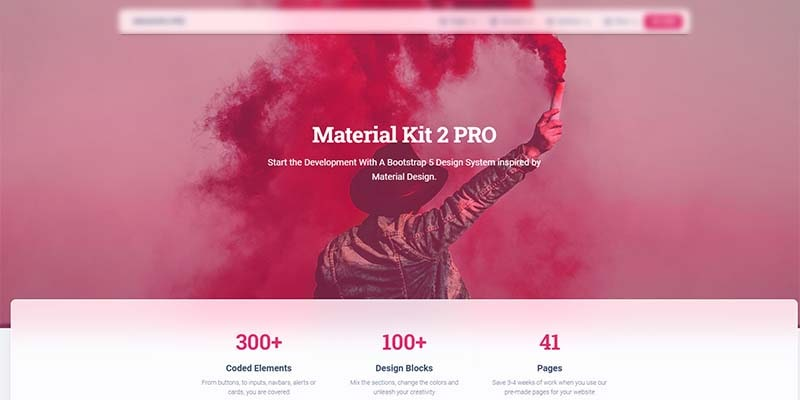

# Flask Material Kit 2 PRO

****[**Material Kit 2**](https://appseed.us/product/flask-material-kit2-pro) is a premium design crafted by `Creative-Tim` agency on top of Bootstrap 5 Framework. Designed for those who like bold elements and beautiful websites, **Material Kit 2** is made of hundred of elements, designed blocks, and fully coded pages built with an impressive level of quality. The `Flask codebase` provides bare minimum essential features that help you to start faster a new project. &#x20;

> Features&#x20;

* `Up-to-date dependencies`: **Flask 2.0.1**
* `SCSS compilation` via **Gulp**
* `DB Tools`: SQLite, Flask-SQLAlchemy ORM
* Session-Based auth flow (login, register)
* `Deployment`: **Docker**, Gunicorn / Nginx, Heroku
* Support via **Github** (issues tracker) and [Discord](https://discord.gg/fZC6hup).

> Links

* 👉 [Flask Material Kit 2 PRO](https://appseed.us/product/flask-material-kit2-pro) - product page
* 👉 [Flask Material Kit 2 PRO](https://flask-material-kit2-pro.appseed-srv1.com) - LIVE Demo
* 👉 [Material Kit 2 PRO](https://www.creative-tim.com/learning-lab/bootstrap/overview/material-kit?AFFILIATE=128200) - UI Docs&#x20;

### ✨ What is Flask

**Flask** is a lightweight [WSGI](../../content/what-is/wsgi.md) web application framework. It is designed to make getting started quick and easy, with the ability to scale up to complex applications. Classified as a microframework, Flask is written in Python and it does not require particular tools or libraries. It has no database abstraction layer, form validation, or any other components where pre-existing third-party libraries provide common functions.

> Read more about [Flask Framework](../../content/what-is/flask.md)

### ✨ How to use the App

* [Set up the environment](../../boilerplate-code/flask.md#environment) - prepare your workstation
* [Compile the sources](../../boilerplate-code/flask.md#build-the-app) - start the app in the local environment
* [App Codebase](../../boilerplate-code/flask.md#app-codebase-simplified-1) - how the files are organized
* [App Configuration](../../boilerplate-code/flask.md#app-configuration) - how to configure the application

### ✨ Material Kit 2 PRO

**Material Kit 2 PRO** is built with over 300 frontend individual elements, like buttons, inputs, navbars, nav tabs, cards, or alerts, giving you the freedom of choosing and combining. All components can take variations in color, which you can easily modify using SASS files and classes.

* [Material Kit 2 PRO](https://www.creative-tim.com/product/material-kit-pro?AFFILIATE=128200) - BS5 version (product page)
* [Material Kit 2 PRO](https://www.creative-tim.com/learning-lab/bootstrap/overview/material-kit?AFFILIATE=128200) - UI Documentation&#x20;

&#x20;
