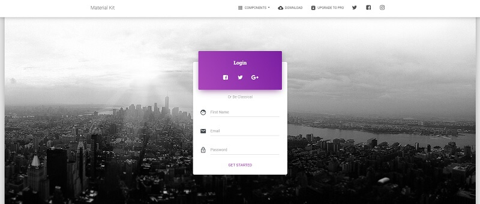

# Flask Material Kit

 **Material Kit** is a **Free Bootstrap 4 UI Kit** with a fresh, new design inspired by Google's material design.  **Material Kit** makes use of light, surface, and movement. It uses a deliberate color choice, edge-to-edge imagery, and large-scale typography.  For newcomers, **Flask** is a lightweight web application framework written in Python that can be easily extended to become an API, a simple one-page project, or complex eCommerce solutions.

> Features

* SQLite database, Flask-SQLAlchemy ORM
* Session-Based auth flow \(login, register\)
* Deployment scripts: Docker, Gunicorn / Nginx, Heroku 

> Links

* [Flask Material Kit](https://appseed.us/apps/flask-apps/flask-material-kit) - product page
* [Flask Material Kit](https://github.com/app-generator/flask-material-kit) - source code 
* [Flask Material Kit](https://flask-material-kit.appseed-srv1.com/) - LIVE Demo 

> [Support](https://appseed.us/support) \(Email and LIVE on Discord\) for **registered** [**AppSeed**](https://appseed.us/) **users**.

### What is Flask

**Flask** is a lightweight [WSGI](../../content/what-is/wsgi.md) web application framework. It is designed to make getting started quick and easy, with the ability to scale up to complex applications. Classified as a microframework, Flask is written in Python and it does not require particular tools or libraries. It has no database abstraction layer, form validation, or any other components where pre-existing third-party libraries provide common functions.

> Read more about [Flask Framework](../../content/what-is/flask.md)

### How to use the App

* [Set up the environment](../../boilerplate-code/flask.md#environment) - prepare your workstation
* [Compile the sources](../../boilerplate-code/flask-dashboard.md#build-the-app-1) - start the app in the local environment
* [App Codebase](../../boilerplate-code/flask.md#app-codebase) - how the files are organized
* [App Configuration](../../boilerplate-code/flask.md#app-configuration) - how to configure the application

### Material Kit UI

**Material Kit** is a **Free Bootstrap 4 UI Kit** with a fresh, new design inspired by Google's material design. You asked for it, so we built it. It's a great pleasure to introduce to you the material concepts in an _easy-to-use_ and beautiful set of components. Along with the restyling of the Bootstrap elements, you will find three fully-coded example pages, to help you design your next project.

* [Material UI Kit](../../content/bootstrap-template/material-ui-kit.md) - more information provided by AppSeed
* [Material UI Kit](https://bit.ly/3u2lZc6) - product page hosted by [Creative-Tim](../../content/partners/creative-tim.md)

