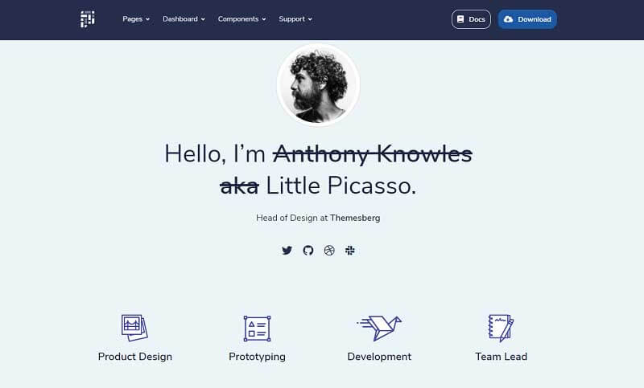

# Flask Pixel Lite

Pixel is a free, fully responsive, and modern Bootstrap 4 UI Kit that will help you build creative and professional websites. Use our components and sections, switch some Sass variables to build and arrange pages to best suit your needs. The Flask codebase is provided with database, ORM, authentication, and deployment scripts.  

> Features

* SQLite database, Flask-SQLAlchemy ORM
* Session-Based auth flow \(login, register\)
* Deployment scripts: Docker, Gunicorn / Nginx, Heroku 

> Links

* [Flask Pixel Lite](https://appseed.us/apps/flask-apps/flask-pixel-bootstrap-uikit) - product page
* [Flask Pixel Lite](https://github.com/app-generator/flask-pixel-bootstrap-uikit) - source code 
* [Flask Pixel Lite](https://flask-pixel-lite.appseed-srv1.com/) - LIVE Demo

> [Support](https://appseed.us/support) \(Email and LIVE on Discord\) for **registered** [**AppSeed**](https://appseed.us/) **users**.

### What is Flask

**Flask** is a lightweight [WSGI](../../content/what-is/wsgi.md) web application framework. It is designed to make getting started quick and easy, with the ability to scale up to complex applications. Classified as a microframework, Flask is written in Python and it does not require particular tools or libraries. It has no database abstraction layer, form validation, or any other components where pre-existing third-party libraries provide common functions.

> Read more about [Flask Framework](../../content/what-is/flask.md)

### How to use the App

* [Set up the environment](../../boilerplate-code/flask.md#environment) - prepare your workstation
* [Compile the sources](../../boilerplate-code/flask-dashboard.md#build-the-app-1) - start the app in the local environment
* [App Codebase](../../boilerplate-code/flask.md#app-codebase) - how the files are organized
* [App Configuration](../../boilerplate-code/flask.md#app-configuration) - how to configure the application

### Pixel Lite UI Kit

Pixel is a premium extension of the famous Bootstrap CSS Framework featuring pricing cards, profile cards, timelines, and many more. All components are created to comply as much as possible with the WCAG 2.1 standards.

* [Pixel Lite](../../content/bootstrap-template/pixel-lite-template.md) - information provided by AppSeed
* [Pixel Lite](https://themesberg.com/product/ui-kit/pixel-free-bootstrap-5-ui-kit) - product page hosted by [Themesberg](../../content/partners/themesberg.md)

