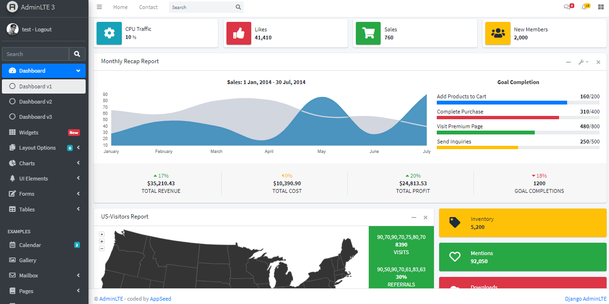

# Flask AdminLTE

One of the best open-source admin dashboard & control panel theme. Built on top of Bootstrap, AdminLTE provides a range of responsive, reusable, and commonly used components. 

> Features

* Codebase - [Flask Dashboard Boilerplate](../../boilerplate-code/flask-dashboard.md)
* UI Kit: **AdminLTE **crafted by ColorLib
* DBMS: SQLite, PostgreSQL (production)
* DB Tools: SQLAlchemy ORM, Flask-Migrate (schema migrations)
* Modular design with **Blueprints**
* Session-Based authentication (via **flask_login**), Forms validation
* Deployment scripts: Docker, Gunicorn / Nginx, HEROKU 

> Links

* [AdminLTE Flask](https://appseed.us/admin-dashboards/flask-dashboard-adminlte) - product page
* [AdminLTE Flask](https://github.com/app-generator/flask-dashboard-adminlte) - source code 
* [AdminLTE Flask](https://adminlte-flask.appseed-srv1.com) - LIVE Demo 

> [Support](https://appseed.us/support) (Email and LIVE on Discord) for **registered **[**AppSeed**](https://appseed.us)** users**.

### What is Flask

**Flask** is a lightweight [WSGI](../../content/what-is/wsgi.md) web application framework. It is designed to make getting started quick and easy, with the ability to scale up to complex applications. Classified as a microframework, Flask is written in Python and it does not require particular tools or libraries. It has no database abstraction layer, form validation, or any other components where pre-existing third-party libraries provide common functions.

> Read more about [Flask Framework](../../content/what-is/flask.md)

### How to use the App

* [Set up the environment](../../boilerplate-code/flask-dashboard.md#environment) - prepare your workstation for **Flask**
* [Compile the sources](../../boilerplate-code/flask-dashboard.md#build-the-app-1) - start this **Flask** app in the local environment
* [App Codebase](../../boilerplate-code/flask-dashboard.md#app-codebase) - how the project files are organized
* [App Configuration](../../boilerplate-code/flask-dashboard.md#app-configuration) - how to configure this **Flask** application

### AdminLTE - UI Kit

**AdminLTE** is a popular open-source template for admin dashboards and control panels. It is a responsive HTML template that is based on the Bootstrap CSS framework. It utilizes all of the Bootstrap components in its design and re-styles many commonly used plugins to create a consistent design that can be used as a user interface for backend applications. AdminLTE is based on a modular design, which allows it to be easily customized and built upon.

* [AdminLTE](https://adminlte.io) - product page (HTML version)

