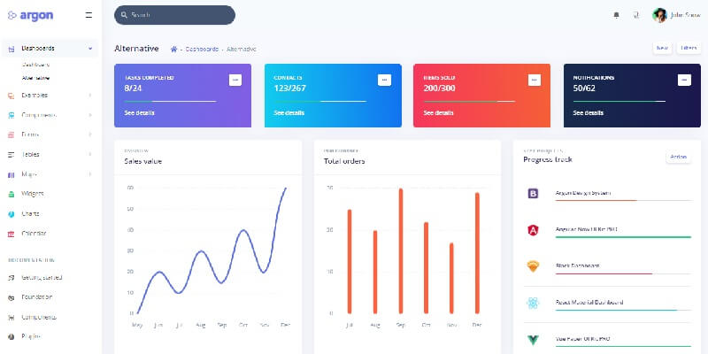

# Flask Argon PRO

**Argon Dashboard** is built with over 200 individual components, giving you the freedom of choosing and combining. This Dashboard is coming with pre-built examples, so the development process is seamless, switching from our pages to the real website is very easy to be done.

> Features

* Codebase - [Flask Dashboard Boilerplate](../../boilerplate-code/flask-dashboard.md)
* UI Kit: [Argon Dashboard PRO](../../content/bootstrap-template/argon-dashboard-pro.md) (premium version)
* DBMS: SQLite, PostgreSQL (production)
* DB Tools: SQLAlchemy ORM, Flask-Migrate (schema migrations)
* Modular design with **Blueprints**
* Session-Based authentication (via **flask\_login**), Forms validation
* Deployment scripts: Docker, Gunicorn / Nginx, HEROKU

> Links

* [Argon PRO Flask](https://appseed.us/admin-dashboards/flask-dashboard-argon-pro) - product page
* [Argon PRO Flask](https://github.com/app-generator/flask-dashboard-argon-pro) - public repository used for bug tracking
* [Argon PRO Flask](https://flask-argon-dashboard-pro.appseed-srv1.com/) - LIVE Demo
* [Support](https://appseed.us/support):  via **Github** (issues tracker) and [Discord](https://discord.gg/fZC6hup) - 24/7 LIVE Assistance.

### What is Flask

**Flask** is a lightweight [WSGI](../../content/what-is/wsgi.md) web application framework. It is designed to make getting started quick and easy, with the ability to scale up to complex applications. Classified as a microframework, Flask is written in Python and it does not require particular tools or libraries. It has no database abstraction layer, form validation, or any other components where pre-existing third-party libraries provide common functions.

> Read more about [Flask Framework](../../content/what-is/flask.md)

### How to use the App

* [Set up the environment](../../boilerplate-code/flask-dashboard.md#environment) - prepare your workstation for **Flask**
* [Compile the sources](../../boilerplate-code/flask-dashboard.md#build-the-app-1) - start this **Flask** app in the local environment
* [App Codebase](../../boilerplate-code/flask-dashboard.md#app-codebase) - how the project files are organized
* [App Configuration](../../boilerplate-code/flask-dashboard.md#app-configuration) - how to configure this **Flask** application

### Argon PRO - UI Kit

Argon is a completely new product built on our newest re-built from scratch framework structure that is meant to make our products more intuitive, more adaptive, and needless to say, so much easier to customize. Let Argon amaze you with its cool features and build tools and get your project to a whole new level.

* [Argon PRO](../../content/bootstrap-template/argon-dashboard-pro.md) - information provided by AppSeed
* [Argon PRO](https://bit.ly/39D2BLX) - product page hosted by [Creative-Tim](../../content/partners/creative-tim.md)

