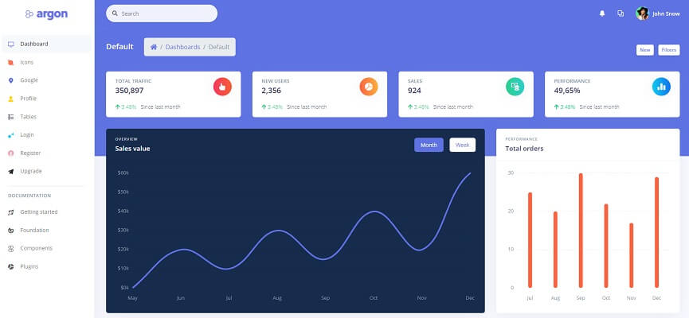

# Argon Dashboard Flask

**Argon Dashboard** is built with over 100 individual components, giving you the freedom of choosing and combining. All components can take variations in color, that you can easily modify using SASS files. This Dashboard is coming with pre-built examples, so the development process is seamless, switching from our pages to the real website is very easy to be done.

> Features

* Codebase - [Flask Dashboard Boilerplate](../../boilerplate-code/flask-dashboard.md)
* UI Kit: [Argon Dashboard](../../content/bootstrap-template/argon-dashboard.md) \(free version\) 
* DBMS: SQLite, PostgreSQL \(production\)
* DB Tools: SQLAlchemy ORM, Flask-Migrate \(schema migrations\)
* Modular design with **Blueprints**
* Session-Based authentication \(via **flask\_login**\), Forms validation
* Deployment scripts: Docker, Gunicorn / Nginx, HEROKU 

> Links

* [Argon Dashboard Flask](https://appseed.us/admin-dashboards/flask-boilerplate-dashboard-argon) - product page
* [Argon Dashboard Flask](https://github.com/app-generator/flask-boilerplate-dashboard-argon) - source code 
* [Argon Dashboard Flask](https://flask-argon-dashboard.appseed-srv1.com/) - LIVE Demo
* [Support](https://appseed.us/support):  via **Github** \(issues tracker\) and [Discord](https://discord.gg/fZC6hup) - 24/7 LIVE Assistance. 

### How to use the App

* [Set up the environment](../../boilerplate-code/flask-dashboard.md#environment) - prepare your workstation
* [Compile the sources](../../boilerplate-code/flask-dashboard.md#build-the-app-1) - start the app in the local environment
* [App Codebase](../../boilerplate-code/flask-dashboard.md#app-codebase) - how the files are organized
* [App Configuration](../../boilerplate-code/flask-dashboard.md#app-configuration) - how to configure the application

### [Argon Dashboard](../../content/bootstrap-template/argon-dashboard.md) - UI Kit

**Argon Dashboard** is built with over 100 individual components, giving you the freedom of choosing and combining. Using this free dashboard template you might save a lot of time going from prototyping to full-functional code because all elements are implemented. This Dashboard is coming with pre-built examples, so the development process is seamless, switching from our pages to the real website is very easy to be done.

* [Argon Dashboard](../../content/bootstrap-template/argon-dashboard.md) - information provided by AppSeed
* [Argon Dashboard](https://bit.ly/2KEZQiF) - product page hosted by [Creative-Tim](../../content/partners/creative-tim.md)

