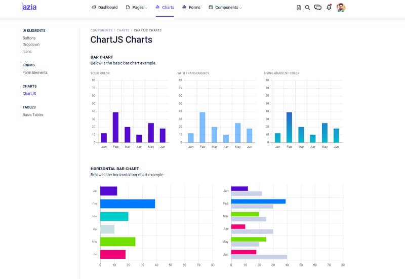

# Flask Azia Dashboard

**Azia Dashboard** is a beautifully designed admin template featuring a fine selection of useful Bootstrap components and elements. The pre-built pages of the templates are intuitive and very well-designed. For newcomers, **Flask** is a lightweight web application framework written in Python that can be easily extended to become an API, a simple one-page project, or complex eCommerce solutions.

> Features

* Codebase - [Flask Dashboard Boilerplate](../../boilerplate-code/flask-dashboard.md)
* UI Kit: **Azia Dashboard** (free version)&#x20;
* DBMS: SQLite, PostgreSQL (production)
* DB Tools: SQLAlchemy ORM, Flask-Migrate (schema migrations)
* Modular design with **Blueprints**
* Session-Based authentication (via **flask\_login**), Forms validation
* Deployment scripts: Docker, Gunicorn / Nginx, HEROKU&#x20;

> Links

* [Azia Dashboard Flask](https://github.com/app-generator/flask-dashboard-azia) - source code&#x20;
* [Azia Dashboard Flask](https://flask-dashboard-azia.appseed-srv1.com) - LIVE Demo&#x20;

> [Support](https://appseed.us/support) (Email and LIVE on Discord) for **registered** [**AppSeed**](https://appseed.us) **users**.

### What is Flask

**Flask** is a lightweight [WSGI](../../content/what-is/wsgi.md) web application framework. It is designed to make getting started quick and easy, with the ability to scale up to complex applications. Classified as a microframework, Flask is written in Python and it does not require particular tools or libraries. It has no database abstraction layer, form validation, or any other components where pre-existing third-party libraries provide common functions.

> Read more about [Flask Framework](../../content/what-is/flask.md)

### How to use the App

* [Set up the environment](../../boilerplate-code/flask-dashboard.md#environment) - prepare your workstation for **Flask**
* [Compile the sources](../../boilerplate-code/flask-dashboard.md#build-the-app-1) - start this **Flask** app in the local environment
* [App Codebase](../../boilerplate-code/flask-dashboard.md#app-codebase) - how the project files are organized
* [App Configuration](../../boilerplate-code/flask-dashboard.md#app-configuration) - how to configure this **Flask** application

### Azia Dashboard - UI Kit

**Azia** features many essential utility classes that can help cut down CSS bloat and modify CSS components instantly. The pre-built pages of the templates are intuitive and very well-designed.

* [Azia Dashboard](https://bit.ly/3m10jIM) - product page hosted by BootstrapDash

