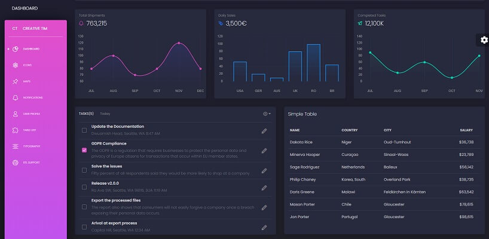

# Black Dashboard Flask

**Flask** Admin Dashboard generated by the AppSeed platform on top of **Black Dashboard** design \(free version\) crafted by CodedThemes.

> Features

* Codebase - [Flask Dashboard Boilerplate](../../boilerplate-code/flask-dashboard.md)
* UI Kit: [Black Dashboard](../../content/bootstrap-template/black-dashboard.md) \(free version\) 
* DBMS: SQLite, PostgreSQL \(production\)
* DB Tools: SQLAlchemy ORM, Flask-Migrate \(schema migrations\)
* Modular design with **Blueprints**
* Session-Based authentication \(via **flask\_login**\), Forms validation
* Deployment scripts: Docker, Gunicorn / Nginx, HEROKU 

> Links

* [Black Dashboard Flask](https://appseed.us/admin-dashboards/flask-dashboard-black) - product page
* [Black Dashboard Flask](https://github.com/app-generator/flask-black-dashboard) - source code 
* [Black Dashboard Flask](https://flask-black-dashboard.appseed-srv1.com/) - LIVE Demo
* [Support](https://appseed.us/support):  via **Github** \(issues tracker\) and [Discord](https://discord.gg/fZC6hup) - 24/7 LIVE Assistance. 

### How to use the App

* [Set up the environment](../../boilerplate-code/flask-dashboard.md#environment) - prepare your workstation
* [Compile the sources](../../boilerplate-code/flask-dashboard.md#build-the-app-1) - start the app in the local environment
* [App Codebase](../../boilerplate-code/flask-dashboard.md#app-codebase) - how the files are organized
* [App Configuration](../../boilerplate-code/flask-dashboard.md#app-configuration) - how to configure the application

### \*\*\*\*[**Black Dashboard**](../../content/bootstrap-template/black-dashboard.md) ****- UI Kit

**Black Dashboard** is a beautiful Bootstrap 4 Admin Dashboard with a huge number of components built to fit together and look amazing. Black Dashboard comes packed with all plugins that you might need inside a project and documentation on how to get started. It is light and easy to use, and also very powerful.

* [Black Dashboard](../../content/bootstrap-template/black-dashboard.md) - more information provided by AppSeed
* [Black Dashboard](https://www.creative-tim.com/product/black-dashboard?AFFILIATE=128200) - product page hosted by [Creative-Tim](../../content/partners/creative-tim.md)

