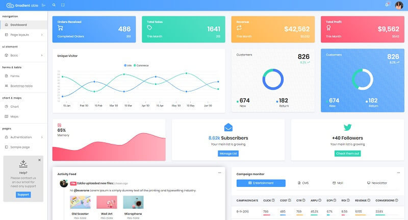

# Gradient Able Flask

[Gradient Able](https://appseed.us/admin-dashboards/flask-gradient-able) Bootstrap 4 Free/Lite Admin Template is a complete solution for your dashboard creation. **Gradient Able** stands out from the crowd with an elegant look that combines soft gradient colors with well-suited typography and great cards and graphics. 

> Features

* Codebase - [Flask Dashboard Boilerplate](../../boilerplate-code/flask-dashboard.md)
* UI Kit: Gradient Able \(free version\) 
* DBMS: SQLite, PostgreSQL \(production\)
* DB Tools: SQLAlchemy ORM, Flask-Migrate \(schema migrations\)
* Modular design with **Blueprints**
* Session-Based authentication \(via **flask\_login**\), Forms validation
* Deployment scripts: Docker, Gunicorn / Nginx, HEROKU 

> Links

* [Gradient Able Flask](https://appseed.us/admin-dashboards/flask-gradient-able) - product page
* [Gradient Able Flask](https://github.com/app-generator/flask-gradient-able) - source code
* [Gradient Able Flask](https://flask-gradient-able.appseed-srv1.com/) - LIVE Demo
* [Support](https://appseed.us/support):  via **Github** \(issues tracker\) and [Discord](https://discord.gg/fZC6hup) - 24/7 LIVE Assistance. 

### How to use the App

* [Set up the environment](../../boilerplate-code/flask-dashboard.md#environment) - prepare your workstation
* [Compile the sources](../../boilerplate-code/flask-dashboard.md#build-the-app-1) - start the app in the local environment
* [App Codebase](../../boilerplate-code/flask-dashboard.md#app-codebase) - how the files are organized
* [App Configuration](../../boilerplate-code/flask-dashboard.md#app-configuration) - how to configure the application

### Gradient Able - UI Kit

**Gradient Able** is a beautiful admin dashboard template built over [Bootstrap 4 ](http://getbootstrap.com/)It will help you get started developing your project dashboards in no time. Using Gradient Able Dashboard is pretty simple but requires basic knowledge of javascript, CSS, and of course [Bootstrap](http://getbootstrap.com/).

* [Gradient Able](https://bit.ly/3b0H1ks) - product page hosted by CodedThemes

