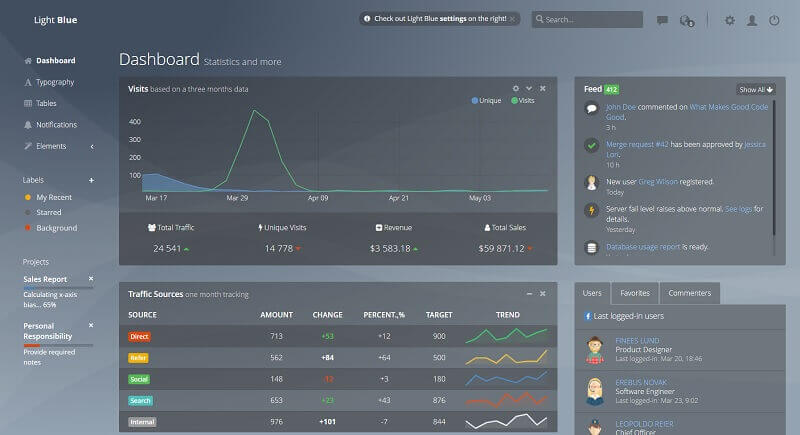

# Flask Light Blue

Light Blue Dashboard is a world-first transparent admin template built with Bootstrap and pure Javascript \(No frameworks\). It comes with a big collection of elements that will offer you multiple possibilities to create the app that best fits your needs.

> Features

* Codebase - [Flask Dashboard Boilerplate](../../boilerplate-code/flask-dashboard.md)
* UI Kit: Light Blue \(free version\) provided by **FlatLogic** 
* DBMS: SQLite, PostgreSQL \(production\)
* DB Tools: SQLAlchemy ORM, Flask-Migrate \(schema migrations\)
* Modular design with **Blueprints**
* Session-Based authentication \(via **flask\_login**\), Forms validation
* Deployment scripts: Docker, Gunicorn / Nginx, HEROKU 

> Links

* [Flask Light Blue](https://appseed.us/admin-dashboards/flask-dashboard-light-blue) - product page
* [Flask Light Blue](https://github.com/app-generator/flask-dashboard-light-blue) - source code 
* [Flask Light Blue](https://flask-dashboard-light-blue.appseed.us/)  - LIVE Demo
* [Support](https://appseed.us/support):  via **Github** \(issues tracker\) and [Discord](https://discord.gg/fZC6hup) - 24/7 LIVE Assistance. 

### What is Flask

**Flask** is a lightweight [WSGI](../../content/what-is/wsgi.md) web application framework. It is designed to make getting started quick and easy, with the ability to scale up to complex applications. Classified as a microframework, Flask is written in Python and it does not require particular tools or libraries. It has no database abstraction layer, form validation, or any other components where pre-existing third-party libraries provide common functions.

> Read more about [Flask Framework](../../content/what-is/flask.md)

### How to use the App

* [Set up the environment](../../boilerplate-code/flask-dashboard.md#environment) - prepare your workstation for **Flask**
* [Compile the sources](../../boilerplate-code/flask-dashboard.md#build-the-app-1) - start this **Flask** app in the local environment
* [App Codebase](../../boilerplate-code/flask-dashboard.md#app-codebase) - how the project files are organized
* [App Configuration](../../boilerplate-code/flask-dashboard.md#app-configuration) - how to configure this **Flask** application

### Light Blue UI Kit

**Light Blue Dashboard** is built on top of Bootstrap 4 and it is fully responsive. You can use Light Blue to build any type of web application like SAAS, CMS, CRM data analytics software, project management systems, etc.

* [Light Blue Dashboard](../../content/bootstrap-template/light-bootstrap-dashboard.md) - more information provided by AppSeed
* [Light Blue Dashboard](https://github.com/flatlogic/light-blue-dashboard) - source code published on Github 

