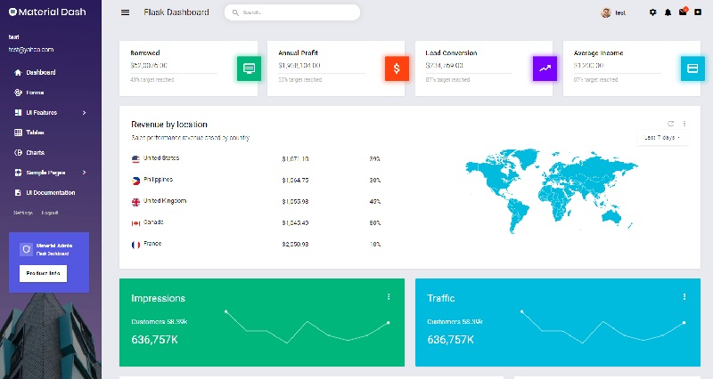

# Flask Material Admin

 **Material Admid** is an open-source dashboard template Based on Bootstrap 4.4 framework and also the JS/jQuery plugin. It comes with a big collection of elements that will offer you multiple possibilities to create the app that best fits your needs. 

> Features

* Codebase - [Flask Dashboard Boilerplate](../../boilerplate-code/flask-dashboard.md)
* UI Kit: [**Material Admin**](https://github.com/BootstrapDash/Material-Admin) \(free version\) 
* DBMS: SQLite, PostgreSQL \(production\)
* DB Tools: SQLAlchemy ORM, Flask-Migrate \(schema migrations\)
* Modular design with **Blueprints**
* Session-Based authentication \(via **flask\_login**\), Forms validation
* Deployment scripts: Docker, Gunicorn / Nginx, HEROKU 

> Links

* [Material Admin Flask](https://appseed.us/admin-dashboards/flask-dashboard-admin-material) - product page
* [Material Admin Flask](https://github.com/app-generator/flask-dashboard-material-admin) - source code 
* [Material Admin Flask](https://flask-dashboard-material-admin.appseed.us/) - LIVE Deployment
* [Support](https://appseed.us/support):  via **Github** \(issues tracker\) and [Discord](https://discord.gg/fZC6hup) - 24/7 LIVE Assistance. 

### 

### What is Flask

**Flask** is a lightweight [WSGI](../../content/what-is/wsgi.md) web application framework. It is designed to make getting started quick and easy, with the ability to scale up to complex applications. Classified as a microframework, Flask is written in Python and it does not require particular tools or libraries. It has no database abstraction layer, form validation, or any other components where pre-existing third-party libraries provide common functions.

> Read more about [Flask Framework](../../content/what-is/flask.md)

### How to use the App

* [Set up the environment](../../boilerplate-code/flask-dashboard.md#environment) - prepare your workstation for **Flask**
* [Compile the sources](../../boilerplate-code/flask-dashboard.md#build-the-app-1) - start this **Flask** app in the local environment
* [App Codebase](../../boilerplate-code/flask-dashboard.md#app-codebase) - how the project files are organized
* [App Configuration](../../boilerplate-code/flask-dashboard.md#app-configuration) - how to configure this **Flask** application

### Material Admin UI Kit

One of the best open-source admin dashboard design. **Material Admin** is a free admin template that is entirely built using the framework Google’s Material Design for the Web to comply with the Material Design guidelines.

* [Material Admin](https://github.com/BootstrapDash/Material-Admin) - source code published on Github

