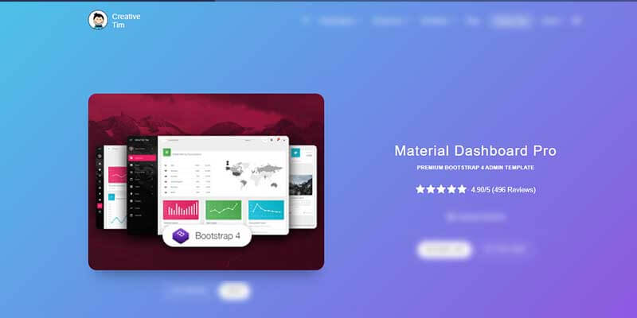

# Flask Material PRO

**Material Dashboard PRO** is a Premium Material Bootstrap 4 Admin with a fresh, new design inspired by Google's Material Design. It is based on the popular Bootstrap 4 framework and comes packed with multiple third-party plugins. All components are built to fit perfectly with each other while aligning with the material concepts. 

> Features

* Codebase - [Flask Dashboard Boilerplate](../../boilerplate-code/flask-dashboard.md)
* UI Kit: [Material Dashboard PRO](../../content/bootstrap-template/material-dashboard-pro.md) \(premium version\) 
* DBMS: SQLite, PostgreSQL \(production\)
* DB Tools: SQLAlchemy ORM, Flask-Migrate \(schema migrations\)
* Modular design with **Blueprints**
* Session-Based authentication \(via **flask\_login**\), Forms validation
* Deployment scripts: Docker, Gunicorn / Nginx, HEROKU 

> Links

* [Material PRO Flask](https://appseed.us/admin-dashboards/flask-dashboard-material-pro) - product page
* [Material PRO Flask](https://github.com/app-generator/flask-dashboard-material-pro) - public repository used for bug tracking
* [Material PRO Flask](https://flask-material-dashboard-pro.appseed-srv1.com/) - LIVE Demo
* [Support](https://appseed.us/support):  via **Github** \(issues tracker\) and [Discord](https://discord.gg/fZC6hup) - 24/7 LIVE Assistance. 

### What is Flask

**Flask** is a lightweight [WSGI](../../content/what-is/wsgi.md) web application framework. It is designed to make getting started quick and easy, with the ability to scale up to complex applications. Classified as a microframework, Flask is written in Python and it does not require particular tools or libraries. It has no database abstraction layer, form validation, or any other components where pre-existing third-party libraries provide common functions.

> Read more about [Flask Framework](../../content/what-is/flask.md)

### How to use the App

* [Set up the environment](../../boilerplate-code/flask-dashboard.md#environment) - prepare your workstation for **Flask**
* [Compile the sources](../../boilerplate-code/flask-dashboard.md#build-the-app-1) - start this **Flask** app in the local environment
* [App Codebase](../../boilerplate-code/flask-dashboard.md#app-codebase) - how the project files are organized
* [App Configuration](../../boilerplate-code/flask-dashboard.md#app-configuration) - how to configure this **Flask** application

### Material Dashboard PRO UI Kit

Material Dashboard PRO makes use of light, surface, and movement. The general layout resembles sheets of paper following multiple layers so that the depth and order is obvious. The product is a powerful dashboard that can easily help you build admin panels, CRMs or content management systems.

* [Material Dashboard PRO](../../content/bootstrap-template/material-dashboard-pro.md) - information provided by AppSeed
* [Material Dashboard PRO](https://bit.ly/3odmcGy) - product page hosted by [Creative-Tim](../../content/partners/creative-tim.md)

