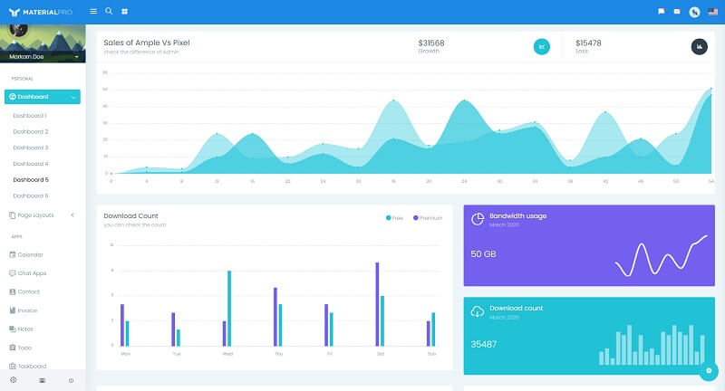

# [MaterialPro Flask](https://appseed.us/product/material-wpx-pro/flask/)

WrapPixel’s **MaterialPro Bootstrap Admin** is a premium bootstrap material design template that comes packed with new, fresh, and attractive designs and ready-to-use components.

## [Black Friday](https://appseed.us/discounts/) - `75%OFF`

> The [campaign](https://appseed.us/discounts/)  is active until `30.NOV` and applies to all products and licenses.

<figure><figcaption>
Black Friday - 75%OFF 
</figcaption></figure>

> Features

* Codebase - [Flask Dashboard Boilerplate](../../boilerplate-code/flask-dashboard.md)
* UI Kit: [MaterialPro](../../content/bootstrap-template/materialpro-wpx.md) (premium version) 
* DBMS: SQLite, PostgreSQL (production)
* DB Tools: SQLAlchemy ORM, Flask-Migrate (schema migrations)
* Modular design with **Blueprints**
* Session-Based authentication (via **flask\_login**), Forms validation
* Deployment scripts: Docker, Gunicorn / Nginx, HEROKU

> Links

* [MaterialPro Flask](https://appseed.us/product/material-wpx-pro/flask/) - product page
* [MaterialPro Flask](https://github.com/app-generator/flask-material-wpx-pro) - public repository used for tracking issues 
* [MaterialPro Flask](https://flask-material-wpx-pro.appseed-srv1.com/) - LIVE Demo
* [Support](https://appseed.us/support):  via **Github** (issues tracker) and [Discord](https://discord.gg/fZC6hup) - 24/7 LIVE Assistance.

### What is Flask

**Flask** is a lightweight [WSGI](../../content/what-is/wsgi.md) web application framework. It is designed to make getting started quick and easy, with the ability to scale up to complex applications. Classified as a microframework, Flask is written in Python and it does not require particular tools or libraries. It has no database abstraction layer, form validation, or any other components where pre-existing third-party libraries provide common functions.

> Read more about [Flask Framework](../../content/what-is/flask.md)

### How to use the App

* [Set up the environment](../../boilerplate-code/flask-dashboard.md#environment) - prepare your workstation for **Flask**
* [Compile the sources](../../boilerplate-code/flask-dashboard.md#build-the-app-1) - start this **Flask** app in the local environment
* [App Codebase](../../boilerplate-code/flask-dashboard.md#app-codebase) - how the project files are organized
* [App Configuration](../../boilerplate-code/flask-dashboard.md#app-configuration) - how to configure this **Flask** application

### MaterialPro WrapPixel UI Kit

**Material Pro** Bootstrap Admin dashboard is versatile, user-friendly, and has a clean code structure that optimizes the development cost and time. The smoothness and efficiency in using a customizable admin dashboard are felt with the reliable design inspiration by Google’s material design.

* [MaterialPro Wpx](../../content/bootstrap-template/materialpro-wpx.md) - information provided by AppSeed
* [MaterialPro Wpx](https://bit.ly/2NRHoFb) - product page hosted by [WrapPixel](../../content/partners/wrappixel.md).

