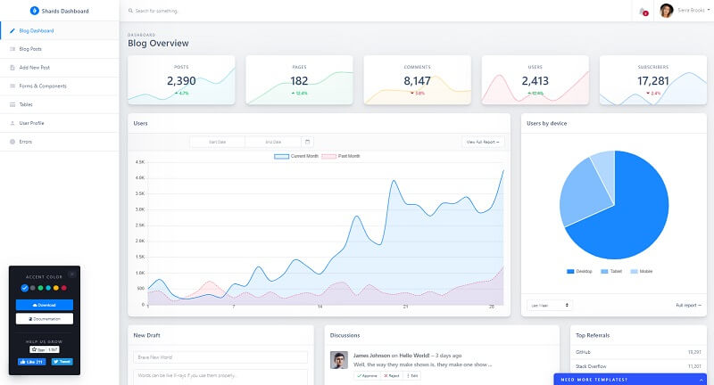

# [Shards Flask](https://appseed.us/product/shards/flask/)

A high-quality & free Bootstrap admin dashboard template pack that comes with lots of templates and components. Based on Bootstrap 4, **Shards Dashboard Lite** is fully responsive and capable to adapt its layout to any viewport size.

> Features

* Codebase - [Flask Dashboard Boilerplate](../../boilerplate-code/flask-dashboard.md)
* UI Kit: **Shards Lite** (free version) crafted by DesignRevision
* DBMS: SQLite, PostgreSQL (production)
* DB Tools: SQLAlchemy ORM, Flask-Migrate (schema migrations)
* Modular design with **Blueprints**
* Session-Based authentication (via **flask\_login**), Forms validation
* Deployment scripts: Docker, Gunicorn / Nginx, HEROKU

> Links

* [Shards Flask](https://appseed.us/product/shards/flask/) - product page
* [Shards Flask](https://github.com/app-generator/flask-dashboard-shards) - source code
* [Shards Flask](https://flask-dashboard-shards.appseed.us/) - LIVE Demo

> [Support](https://appseed.us/support) (Email and LIVE on Discord) for **registered** [**AppSeed**](https://appseed.us/) **users**.

### What is Flask

**Flask** is a lightweight [WSGI](../../content/what-is/wsgi.md) web application framework. It is designed to make getting started quick and easy, with the ability to scale up to complex applications. Classified as a microframework, Flask is written in Python and it does not require particular tools or libraries. It has no database abstraction layer, form validation, or any other components where pre-existing third-party libraries provide common functions.

> Read more about [Flask Framework](../../content/what-is/flask.md

### How to use the App

* [Set up the environment](../../boilerplate-code/flask-dashboard.md#environment) - prepare your workstation for **Flask**
* [Compile the sources](../../boilerplate-code/flask-dashboard.md#build-the-app-1) - start this **Flask** app in the local environment
* [App Codebase](../../boilerplate-code/flask-dashboard.md#app-codebase) - how the project files are organized
* [App Configuration](../../boilerplate-code/flask-dashboard.md#app-configuration) - how to configure this **Flask** application

### Shards Dashboard UI

A high-quality & free Bootstrap admin dashboard template pack that comes with lots of templates and components. Based on Bootstrap 4, **Shards Dashboard Lite** is fully responsive and capable to adapt its layout to any viewport size.

* [Shards Dashboard](../../content/bootstrap-template/shards-dashboard.md) - information provided by AppSeed
* [Shards Dashboard](https://designrevision.com/downloads/shards-dashboard-lite/) - product page hosted by DesignRevision

