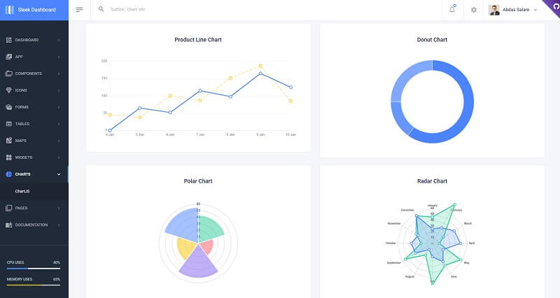

# Flask Sleek Admin

**Sleek Dashboard** - Free Bootstrap 4 Admin Dashboard Template and UI Kit. It is s very powerful _bootstrap_ admin dashboard, which allows you to build products like admin panels, content management systems, and CRMs.

> Features

* Codebase - [Flask Dashboard Boilerplate](../../boilerplate-code/flask-dashboard.md)
* UI Kit: **Sleek Admin** crafted by **TAF Coder**
* DBMS: SQLite, PostgreSQL (production)
* DB Tools: SQLAlchemy ORM, Flask-Migrate (schema migrations)
* Modular design with **Blueprints**
* Session-Based authentication (via **flask\_login**), Forms validation
* Deployment scripts: Docker, Gunicorn / Nginx, HEROKU

> Links

* [Sleek Admin Flask](https://appseed.us/admin-dashboards/flask-dashboard-sleek) - product page
* [Sleek Admin Flask](https://github.com/app-generator/flask-dashboard-sleek) - source code
* [Sleek Admin Flask](https://flask-dashboard-sleek.appseed.us/) - LIVE Demo

> [Support](https://appseed.us/support) (Email and LIVE on Discord) for **registered** [**AppSeed**](https://appseed.us/) **users**.

### What is Flask

**Flask** is a lightweight [WSGI](../../content/what-is/wsgi.md) web application framework. It is designed to make getting started quick and easy, with the ability to scale up to complex applications. Classified as a microframework, Flask is written in Python and it does not require particular tools or libraries. It has no database abstraction layer, form validation, or any other components where pre-existing third-party libraries provide common functions.

> Read more about [Flask Framework](../../content/what-is/flask.md)

### How to use the App

* [Set up the environment](../../boilerplate-code/flask-dashboard.md#environment) - prepare your workstation for **Flask**
* [Compile the sources](../../boilerplate-code/flask-dashboard.md#build-the-app-1) - start this **Flask** app in the local environment
* [App Codebase](../../boilerplate-code/flask-dashboard.md#app-codebase) - how the project files are organized
* [App Configuration](../../boilerplate-code/flask-dashboard.md#app-configuration) - how to configure this **Flask** application

### Sleek Admin - UI Kit

**Sleek Dashboard** has impressive typography that compliments exceedingly with its colorful and elegant interface. Open-source, MIT licensed product crafted for free by [TAF Coder](https://www.iamabdus.com/). Built with  [Bootstrap](https://getbootstrap.com/), the world's most popular front-end component library for developing with HTML, CSS, and JS. It's open-source, intuitive, and powerful front-end framework for faster and easier web development.

* [Sleek Admin](https://github.com/tafcoder/sleek-dashboard) - source code
* [Sleek Admin](https://sleek.tafcoder.com/) - LIVE demo

