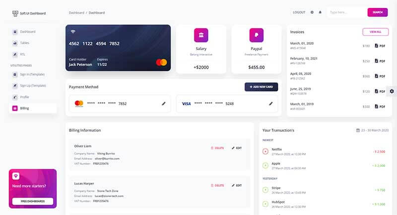

# Flask Soft Dashboard

Designed for those who like bold elements and beautiful websites. Made of hundred of elements, designed blocks, and fully coded pages, **Soft UI Dashboard** is ready to help you create stunning websites and web apps. 

> Features

* Codebase - [Flask Dashboard Boilerplate](../../boilerplate-code/flask-dashboard.md)
* UI Kit: [Soft UI Dashboard](../../content/bootstrap-template/soft-ui-dashboard.md) by [Creative-Tim](../../content/partners/creative-tim.md) ****
* DBMS: SQLite, PostgreSQL \(production\)
* DB Tools: SQLAlchemy ORM, Flask-Migrate \(schema migrations\)
* Modular design with **Blueprints**
* Session-Based authentication \(via **flask\_login**\), Forms validation
* Deployment scripts: Docker, Gunicorn / Nginx, HEROKU 

> Links

* [Flask Soft UI Dashboard](https://flask-soft-ui-dashboard.appseed-srv1.com/) - LIVE demo
* [Flask Soft UI Dashboard](https://github.com/app-generator/flask-soft-ui-dashboard) - Source Code

### How to use the App

* [Set up the environment](../../boilerplate-code/flask-dashboard.md#environment) - prepare your workstation
* [Compile the sources](../../boilerplate-code/flask-dashboard.md#build-the-app-1) - start the app in the local environment
* [App Codebase](../../boilerplate-code/flask-dashboard.md#app-codebase) - how the files are organized
* [App Configuration](../../boilerplate-code/flask-dashboard.md#app-configuration) - how to configure the application

### Soft UI Dashboard - UI Kit

Soft UI Dashboard is built with over 70 frontend individual elements, like buttons, inputs, navbars, nav tabs, cards, alerts, giving you the freedom of choosing and combining. All components can take variations in color, that you can easily modify using SASS files and classes.

* [Soft UI Dashboard](../../content/bootstrap-template/soft-ui-dashboard.md) - more information provided by AppSeed
* [Soft UI Dashboard](https://bit.ly/2Q1uIfK) - product page hosted by **Creative-Tim**

