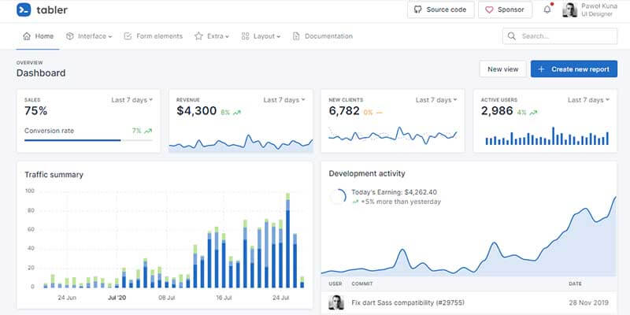

# [Flask Tabler](https://appseed.us/product/tabler/flask/)

**Tabler** is a UI kit that speeds up the development process and makes it easier than ever! Built on the latest version of Bootstrap, it helps you create templates based on fully customizable and ready-to-use UI components, which can be used by both simple websites and sophisticated systems.

> Features

* Codebase - [Flask Dashboard Boilerplate](../../boilerplate-code/flask-dashboard.md)
* UI Kit: **Tabler** design (free version)
* DBMS: SQLite, PostgreSQL (production)
* DB Tools: SQLAlchemy ORM, Flask-Migrate (schema migrations)
* Modular design with **Blueprints**
* Session-Based authentication (via **flask\_login**), Forms validation
* Deployment scripts: Docker, Gunicorn / Nginx, HEROKU

> Links

* [Flask Tabler](https://appseed.us/product/tabler/flask/) - Product page
* [Flask Tabler](https://github.com/app-generator/flask-dashboard-tabler) - Source code
* [Flask Tabler](https://flask-dashboard-tabler.appseed.us/) - LIVE Demo

> [Support](https://appseed.us/support) (Email and LIVE on Discord) for **registered** [**AppSeed**](https://appseed.us/) **users**.

## What is Flask

**Flask** is a lightweight [WSGI](../../content/what-is/wsgi.md) web application framework. It is designed to make getting started quick and easy, with the ability to scale up to complex applications. Classified as a microframework, Flask is written in Python and it does not require particular tools or libraries. It has no database abstraction layer, form validation, or any other components where pre-existing third-party libraries provide common functions.

> Read more about [Flask Framework](../../content/what-is/flask.md)

## How to use the App

* [Set up the environment](../../boilerplate-code/flask-dashboard.md#environment) - prepare your workstation for **Flask**
* [Compile the sources](../../boilerplate-code/flask-dashboard.md#build-the-app-1) - start this **Flask** app in the local environment
* [App Codebase](../../boilerplate-code/flask-dashboard.md#app-codebase) - how the project files are organized
* [App Configuration](../../boilerplate-code/flask-dashboard.md#app-configuration) - how to configure this **Flask** application

## Tabler UI Kit

Tabler is a UI kit that speeds up the development process and makes it easier than ever! Built on the latest version of Bootstrap, it helps you create templates based on fully customizable and ready-to-use UI components, which can be used by both simple websites and sophisticated systems.

* [Tabler Dashboard](../../content/bootstrap-template/tabler.md) - more information provided by AppSeed
* [Tabler Dashboard](https://github.com/admin-dashboards/bootstrap-template-tabler) - source code published on Github

