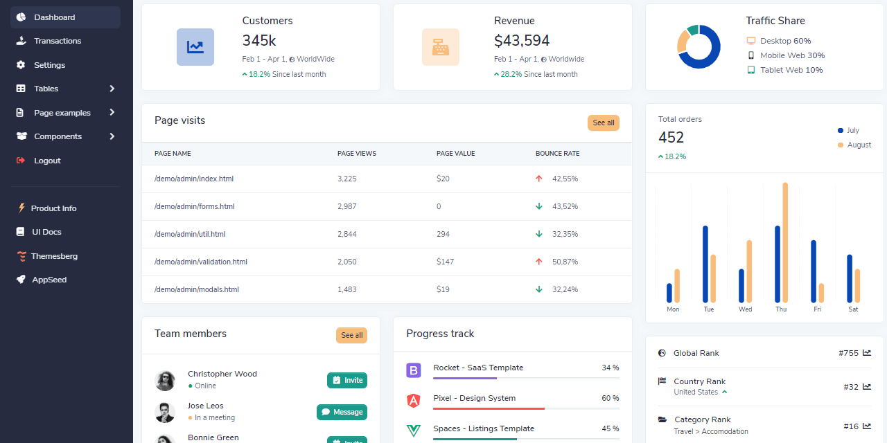

# Flask Volt

Volt is a free and open-source **Bootstrap 5** powered admin dashboard with components, pages and plugins that you can use to create awesome admin interfaces. It also comes with a pro version with more pages, plugins, and components.

> Features

* Codebase - [Flask Dashboard Boilerplate](../../boilerplate-code/flask-dashboard.md)
* UI Kit: Volt Dashboard \(free version\) 
* DBMS: SQLite, PostgreSQL \(production\)
* DB Tools: SQLAlchemy ORM, Flask-Migrate \(schema migrations\)
* Modular design with **Blueprints**
* Session-Based authentication \(via **flask\_login**\), Forms validation
* Deployment scripts: Docker, Gunicorn / Nginx, HEROKU 

> Links

* [Volt Dashboard Flask](https://appseed.us/admin-dashboards/flask-dashboard-volt) - product page
* [Volt Dashboard Flask](https://github.com/app-generator/flask-dashboard-volt) - source code 
* [Volt Dashboard Flask](https://flask-volt-dashboard.appseed-srv1.com/) - LIVE Deployment
* [Support](https://appseed.us/support):  via **Github** \(issues tracker\) and [Discord](https://discord.gg/fZC6hup) - 24/7 LIVE Assistance. 

### 

### What is Flask

**Flask** is a lightweight [WSGI](../../content/what-is/wsgi.md) web application framework. It is designed to make getting started quick and easy, with the ability to scale up to complex applications. Classified as a microframework, Flask is written in Python and it does not require particular tools or libraries. It has no database abstraction layer, form validation, or any other components where pre-existing third-party libraries provide common functions.

> Read more about [Flask Framework](../../content/what-is/flask.md)

### How to use the App

* [Set up the environment](../../boilerplate-code/flask-dashboard.md#environment) - prepare your workstation for **Flask**
* [Compile the sources](../../boilerplate-code/flask-dashboard.md#build-the-app-1) - start this **Flask** app in the local environment
* [App Codebase](../../boilerplate-code/flask-dashboard.md#app-codebase) - how the project files are organized
* [App Configuration](../../boilerplate-code/flask-dashboard.md#app-configuration) - how to configure this **Flask** application

### Volt Dashboard UI Kit

**100+ Components, 11 Sample pages** - There are more than 100 free Bootstrap 5 components included some of them being buttons, alerts, modals, date pickers, all nicely documented via the official components docs. Volt brings 11 example pages including an overview, sign in, sign up, transactions page, and many more.

**Tooling** - Sass files and a Gulp commands file that will let you build minified and un-minified project files with the ability to even add certain blocks of code based on your environment.

* [Volt Dashboard](https://themesberg.com/product/admin-dashboard/volt-bootstrap-5-dashboard) - product page hosted by Themesberg
* [Volt Dashboard](https://themesberg.com/docs/volt-bootstrap-5-dashboard/getting-started/quick-start/) - official documentation 

