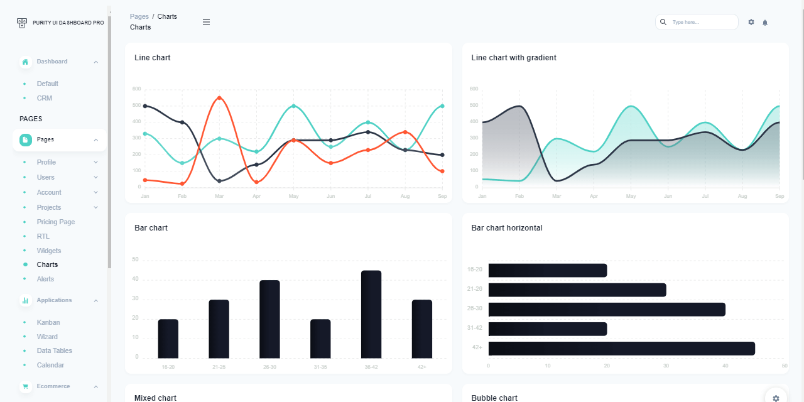
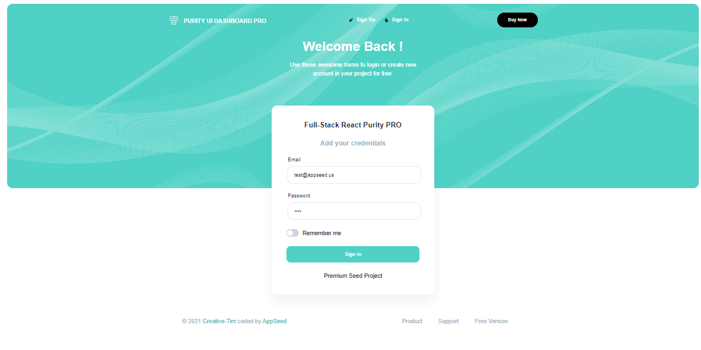

# Full-Stack React Purity

Full-stack version of **React Purity PRO**, a premium design crafted by **Creative-Tim** now usable with multiple API Backend Servers: **Node JS**, Flask, Django. The UI comes with pre-configured **JWT authentication** powered by a [Unified API Interface](../../boilerplate-code/api-server/api-unified-definition.md) that makes this product compatible with more than one backend: Node JS, Flask, Django (FASTapi coming soon). &#x20;

* [Full-stack React Purity Dashboard](https://appseed.us/full-stack/react-purity-dashboard) - product page
* [Full-stack React Purity Dashboard](https://fullstack-react-purity-dashboard.appseed-srv1.com/#/auth/authentication/sign-in/basic) - LIVE Demo
* [UI Docs](https://bit.ly/31AjAwt) - provided by Creative-Tim




### Product Dependencies

To successfully compile and use the product, please make sure your workstation has the right tools installed and accessible in the terminal window:

* [Node JS](https://nodejs.org/en/) 12.x version (or above) - used to build both parts (frontend & backend)
* [GIT](https://git-scm.com) versioning command-line tool - used to clone the sources from Github
* A code editor: [VsCode](https://code.visualstudio.com) or [Atom](https://atom.io)
* Ability to work in the terminal window  &#x20;

### Product Features

The product aims to help developers skip over the basics and start faster a new full-stack product already enhanced with authentication, a pixel-perfect UI powered by production-ready backends. The fact that makes this full-stack product unique is the JSON-API compliance over multiple servers:&#x20;

* ****[Node JS API](../../boilerplate-code/api-server/node-js.md): Typescript, Flexible persistence (SQLite, Mongo), TypeORM, Validation
* [Django API](../../boilerplate-code/api-server/django.md): JWT Authentication over DRF, SQLite, Docker&#x20;
* [Flask API](../../boilerplate-code/api-server/flask.md): powered by Flask-JWT-extended, SQL-Alchemy, Docker
* Coming soon APIs: **FASTapi**, **Laravel API**&#x20;

By default, the UI redirects the guest users to the login page. Once the user is authenticated, all private pages are unlocked.&#x20;

> Implemented JWT Authentication Flow: Login, Logout, Register.&#x20;




### **How to use the product**

Full-stack React Material Dashboard is built using a two-tier architecture where the UI is decoupled from the backend API server and communicates using requests secured by **JWT tokens**. The recommended way to start using this full-stack product is to follow a simple setup:&#x20;

* Step #1 - Build and start the backend server
* Step #2 - Build and start the UI
* Create a new user via the registration page
* Authenticate and access the private pages
* Add your magic on top of the existing codebase.&#x20;


### Start the backend server

As mentioned before, the UI is configured to work with many backend servers that share a common API interface: [Django](../../boilerplate-code/api-server/django.md), [Node JS](../../boilerplate-code/api-server/node-js.md), [Flask](../../boilerplate-code/api-server/flask.md). Based on your license (free or commercial) the access is granted to the request API Server. On this page, we will compile and start the free version of Node JS API (open-source product).&#x20;

> Start [Node JS API Server](../../boilerplate-code/api-server/node-js.md) - open-source version&#x20;

**Step #1 -** Clone the sources

```
$ git clone https://github.com/app-generator/api-server-nodejs.git
$ cd api-server-nodejs
```

**Step #2 - Install dependencies** via NPM or Yarn

```
$ npm i
// OR
$ yarn
```

**Step #3 - Run the SQLite migration** and create the required tables

```
$ yarn typeorm migration:run
```

**Step #4 - Start the API server** - development mode

```
$ npm dev
// OR
$ yarn dev
```

The API interface used by the API is a simple JWT authentication layer that exposes the following methods:&#x20;

* USERS API:
  * `/api/users/register`: create a new user
  * `/api/users/login`: authenticate an existing user
  * `/api/users/logout`: delete the associated JWT token
  * `/api/users/checkSession`: check an existing JWT Token for validity
  * `/api/users/edit` - edit the information associated with a registered user&#x20;

At this point, the backend API should be & and running on address: `http://localhost:5000`  and we can move on with the setup and build the React UI.


### Start the React UI

The **React Material Dashboard** being a commercial product, a license is required before getting access to the source code. In case you don't have a license, please access the product page and purchase one.&#x20;

**Step #1** - Clone the project

```bash
$ git clone https://github.com/app-generator/priv-react-purity-dashboard-pro.git
$ cd priv-react-purity-dashboard-pro
```

**Step #2** - Install dependencies via NPM or yarn

```bash
$ npm i
// OR
$ yarn
```

**Step #3** - Start in development mode

```bash
$ npm run start 
// OR
$ yarn start
```


### Backend Integration

> The backend API server address is saved in `src/config/constant.js`.

```javascript
export const API_SERVER = "http://localhost:5000/api/";
```

Frontend api has been created at `src/api/auth.js`.

```bash
const axios = Axios.create({
    baseURL: `${baseURL}/api`,
    headers: { "Content-Type": "application/json" },
});
```


### Purity React Dashboard

_Official Product Information_ **-** Designed for those who like modern UI elements and beautiful websites. Made of hundred of elements, designed blocks and fully coded pages, Purity UI Dashboard PRO is ready to help you create stunning websites and webapps.

* [Purity React PRO](https://bit.ly/3BDMqIs) - template version
* [Purity React PRO](https://bit.ly/3k7g4jw) - LIVE Demo

If you want to get inspiration or just show something directly to your clients, you can jump-start your development with our pre-built example pages. Every page is spaced well, with attractive layouts and pleasing shapes. From specially designed dashboards for smart homes, virtual reality, and automotives to CRM admins, Purity UI Dashboard PRO has everything you need to quickly set up an amazing project.

.png>)
