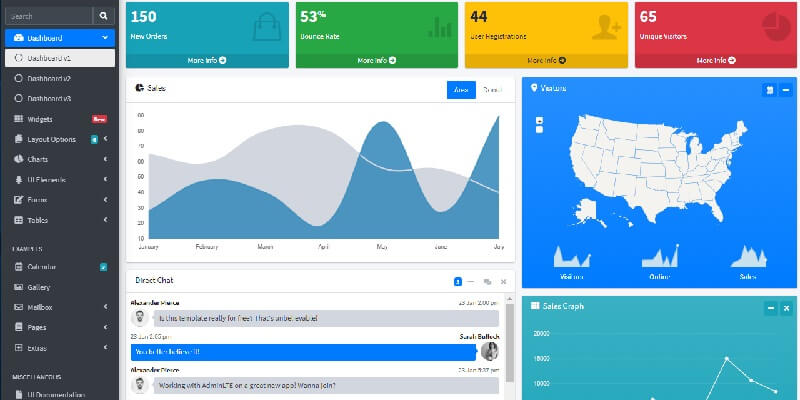

# Jinja AdminLTE

**Jinja Template** project generated by AppSeed on top of **AdminLTE**,  the iconic dashboard template. The project is a super simple Flask project WITHOUT database, ORM, or any other hard dependency. The starter can be used as a codebase for a future project or to migrate the Jinja files and assets to a legacy Python-based project that uses Jinja as the template engine \(Flask, Bottle, Django\). 

> Features:

* Codebase: [Jinja Starter](../../boilerplate-code/boilerplate-jinja.md)  
* Render Engine: Flask / **Jinja2**
* Deployment scripts: Docker, Gunicorn/Nginx, HEROKU

> Links

* [Jinja AdminLTE](https://github.com/app-generator/jinja-adminlte) - source code
* [Jinja AdminLTE](https://adminlte-jinja.appseed-srv1.com/) - LIVE deployment 

> [Support](https://appseed.us/support) \(Email and LIVE on Discord\) for **registered** [**AppSeed**](https://appseed.us/) **users**.

### What is Jinja

[Jinja](https://jinja.palletsprojects.com/en/2.11.x/) is a modern and designer-friendly templating language for Python, modeled after Django’s templates. It is fast, widely used, and secure with the optional sandboxed template execution environment. Jinja is basically an engine used to generate HTML or XML returned to the user via an HTTP response. 

> Read more about [Jinja Template Language](../../content/what-is/jinja.md)

### How to use the App

* [Set up the environment](../../boilerplate-code/boilerplate-jinja.md#environment) - prepare your workstation
* [Compile source code](../../boilerplate-code/boilerplate-jinja.md#build-the-app) - start the project in the local environment
* [Codebase structure](../../boilerplate-code/boilerplate-jinja.md#codebase-structure) - explains how the project files are organized
* [Deployment](../../boilerplate-code/boilerplate-jinja.md#deployment): Docker and HEROKU 

### AdminLTE - UI Kit

**AdminLTE** is a popular open-source template for admin dashboards and control panels. It is a responsive HTML template that is based on the Bootstrap CSS framework. It utilizes all of the Bootstrap components in its design and re-styles many commonly used plugins to create a consistent design that can be used as a user interface for backend applications. AdminLTE is based on a modular design, which allows it to be easily customized and built upon.

* [AdminLTE](adminlte.md) - more information provided by AppSeed
* [AdminLTE](https://adminlte.io/) - product page \(HTML version\)

