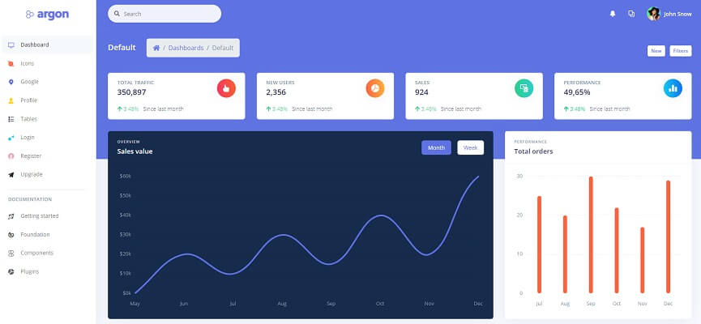

# Jinja Argon Dashboard

**Jinja Template** project generated by AppSeed on top of **Argon Dashboard **(free version),  a popular design crafted by Creative-Tim. The project is a super simple Flask project WITHOUT database, ORM, or any other hard dependency. The starter can be used as a codebase for a future project or to migrate the **Jinja** files and assets to a legacy Python-based project that uses Jinja as the template engine (Flask, Bottle, Django).  

> Features: 

* Codebase: [Jinja Starter](../../boilerplate-code/boilerplate-jinja.md)
* Render Engine: Flask / **Jinja2**
* Deployment scripts: Docker, Gunicorn/Nginx, HEROKU

> Links

* [Jinja Argon Dashboard](https://github.com/app-generator/jinja-argon-dashboard) - source code
* [Jinja Argon Dashboard](https://jinja-argon-dashboard.appseed-srv1.com) - LIVE deployment 

> [Support](https://appseed.us/support) (Email and LIVE on Discord) for **registered **[**AppSeed**](https://appseed.us)** users**. 

### What is Jinja

[Jinja](https://jinja.palletsprojects.com/en/2.11.x/) is a modern and designer-friendly templating language for Python, modeled after Django’s templates. It is fast, widely used, and secure with the optional sandboxed template execution environment. Jinja is basically an engine used to generate HTML or XML returned to the user via an HTTP response. 

> Read more about [Jinja Template Language](../../content/what-is/jinja.md) 

### How to use the App

* [Set up the environment](../../boilerplate-code/boilerplate-jinja.md#environment) - prepare your workstation
* [Compile source code](../../boilerplate-code/boilerplate-jinja.md#build-the-app) - start the project in the local environment
* [Codebase structure](../../boilerplate-code/boilerplate-jinja.md#codebase-structure) - explains how the project files are organized
* [Deployment](../../boilerplate-code/boilerplate-jinja.md#deployment): Docker and HEROKU 

### Argon Dashboard - UI Kit

**Argon Dashboard** is built with over 100 individual components, giving you the freedom of choosing and combining. Using this free dashboard template you might save a lot of time going from prototyping to full-functional code because all elements are implemented. This Dashboard is coming with pre-built examples, so the development process is seamless, switching from our pages to the real website is very easy to be done.

* [Argon Dashboard](../../content/bootstrap-template/argon-dashboard.md) - information provided by AppSeed
* [Argon Dashboard](https://bit.ly/2KEZQiF) - product page hosted by [Creative-Tim](../../content/partners/creative-tim.md)

