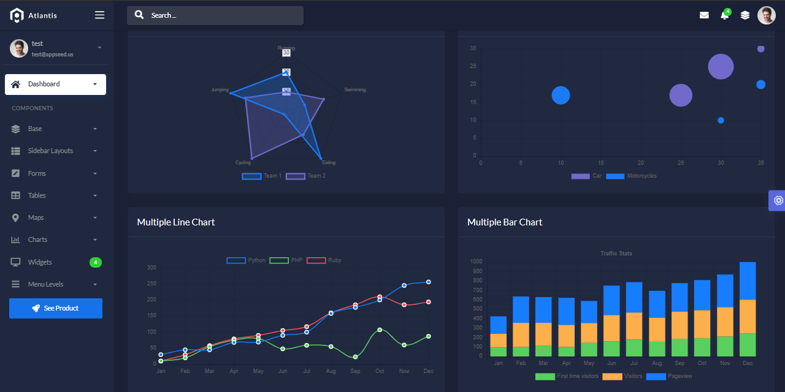

# Atlantis Lite

**Jinja Template** project generated by AppSeed on top of **Atlantis Lite**,  a modern Bootstrap UI Kit. The project is a super simple Flask project WITHOUT database, ORM, or any other hard dependency. The starter can be used as a codebase for a future project or to migrate the Jinja files and assets to a legacy Python-based project that uses Jinja as the template engine \(Flask, Bottle, Django\).

> Features:

* Codebase: [Flask Framework](https://github.com/app-generator/boilerplate-code-jinja) 
* Render Engine: Flask / [Jinja2](https://jinja.palletsprojects.com/)
* Deployment scripts: Docker, Gunicorn/Nginx, HEROKU

> Links

* [Jinja Atlantis Lite](https://appseed.us/jinja-template/jinja-template-atlantis-dark) - product page
* [Jinja Atlantis Lite](https://jinja-atlantis-dark.appseed-srv1.com/) - LIVE Deployment
* [Jinja Atlantis Lite](https://github.com/app-generator/jinja-atlantis-dark) - Source code

### How to use the App

* [Set up the environment](../../boilerplate-code/boilerplate-jinja.md#environment) - prepare your workstation
* [Compile source code](../../boilerplate-code/boilerplate-jinja.md#build-the-app) - start the project in the local environment
* [Codebase structure](../../boilerplate-code/boilerplate-jinja.md#codebase-structure) - explains how the project files are organized
* [Deployment](../../boilerplate-code/boilerplate-jinja.md#deployment): Docker and HEROKU 

### Atlantis Lite - UI Kit

Atlantis Dark Lite admin dashboard has 2 layouts, many plugins, and UI components to help developers create dashboards quickly and effectively so they can save development time and also help users to make the right and fast decisions based on existing data.

* [Atlantis Lite](https://www.themekita.com/atlantis-lite-bootstrap-dashboard.html) - product page \(HTML version\)
* [Atlantis Lite](https://themekita.com/demo-atlantis-bootstrap/livepreview/documentation/) - documentation 

