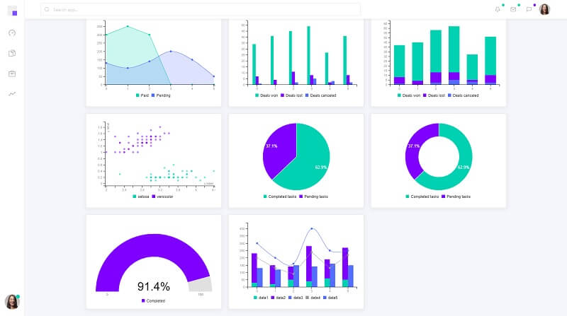
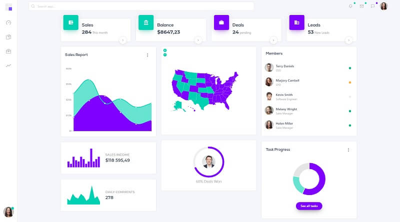

# Jinja Dashkit v3

Jinja Dashkit PRO is a commercial product generated by AppSeed on top of Dashkit PRO v3 (legacy version) - design provided by CssNinja. The design comes with pre-built pages and reusable UI components. The codebase is a simple Flask starter without database, ORM, or other hard dependencies and might be used to integrate this design into legacy Python-based products developed in Flask, Django or Bottle.

* [Flask Dashkit PRO](https://appseed.us/admin-dashboards/flask-dashboard-dashkit-pro) (legacy version) - product page
* [Jinja Dashkit PRO](https://jinja-dashkit-v3.appseed-srv1.com/) (legacy version) - LIVE deployment
* [Dashkit PRO v3](../../content/bulma-css-templates/dashkit-pro-v3.md) - more information about this **UI Kit**




## How to compile the project

Being a Python-based product, **Jinja Dashkit PRO** compilation requires a [minimal programming kit](../../content/tutorials/minimal-programming-kit.md) to be installed and accessible in the terminal.

* [Python](https://www.python.org/) - a modern script language used for many types of projects
* [GIT](https://git-scm.com/) - a command-line tool used to download sources from [Github](https://github.com/)
* A modern editor ([VSCode](https://code.visualstudio.com/), [Atom](https://atom.io/)) to edit the sources - optional dependency

> **Step #1** - Download the ZIP or clone the project (PRIVATE repository)

```
$ git clone https://github.com/app-generator/priv-jinja-dashkit-v3.git
$ cd priv-jinja-dashkit-v3
```

> **Step #2** -  Install dependencies using a Virtual Environment

```
$ virtualenv env
$ source env/bin/activate
$
$ # Install requirements
$ pip3 install -r requirements.txt
```

> **Step #3** - Set up the environment

```
$ export FLASK_APP=run.py
```

> **Step #4** - Start the project

```
$ flask run
```

If all goes well, we should see Jinja Dashkit PRO running in the browser.


