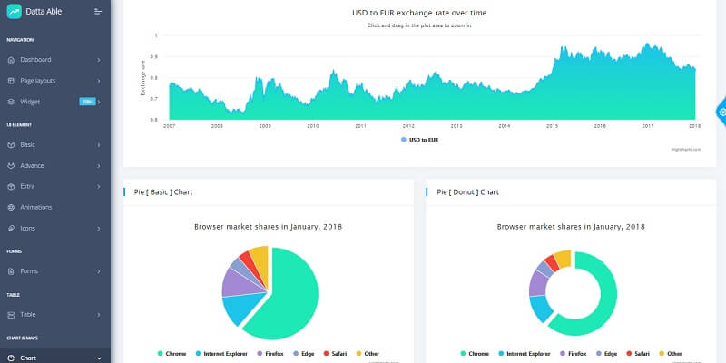

# Jinja Datta Able PRO

**Jinja Template** project generated by AppSeed on top of **Datta Able PRO.** The project is a super simple Flask project WITHOUT database, ORM, or any other hard dependency. The starter can be used as a codebase for a future project or to migrate the Jinja files and assets to a legacy Python-based project that uses Jinja as the template engine (Flask, Bottle, Django).

Datta Able is the most stylish Bootstrap 4 Admin Template compare to all other Bootstrap admin templates. It comes with high feature-rich pages and components with fully developer-centric code.

> Features:&#x20;

* Codebase: [Jinja Starter](../../boilerplate-code/boilerplate-jinja.md)
* Render Engine: Flask / **Jinja2**
* Deployment scripts: Docker, Gunicorn/Nginx, HEROKU

> Links

* [Jinja Datta Able PRO](https://appseed.us/jinja-template/jinja-datta-able-pro) - product page
* [Jinja Datta Able PRO](https://jinja-datta-able-pro.appseed-srv1.com) - LIVE deployment&#x20;

> [Support](https://appseed.us/support) (Email and LIVE on Discord) for **registered** [**AppSeed**](https://appseed.us) **users**.&#x20;

### What is Jinja

[Jinja](https://jinja.palletsprojects.com/en/2.11.x/) is a modern and designer-friendly templating language for Python, modeled after Django’s templates. It is fast, widely used, and secure with the optional sandboxed template execution environment. Jinja is basically an engine used to generate HTML or XML returned to the user via an HTTP response.&#x20;

> Read more about [Jinja Template Language](../../content/what-is/jinja.md)&#x20;

### How to use the App

* [Set up the environment](../../boilerplate-code/boilerplate-jinja.md#environment) - prepare your workstation
* [Compile source code](../../boilerplate-code/boilerplate-jinja.md#build-the-app) - start the project in the local environment
* [Codebase structure](../../boilerplate-code/boilerplate-jinja.md#codebase-structure) - explains how the project files are organized
* [Deployment](../../boilerplate-code/boilerplate-jinja.md#deployment): Docker and HEROKU&#x20;

### [Datta Able PRO](../../content/bootstrap-template/datta-able-pro.md) - UI Kit

**Datta Able** Dashboard Template provides all possible prebuilt layouts which give you the best selection choice of your backend template need for your projects. Comes with error/bug-free, well structured, well-commented code and regularly with all latest updated code. Which saves your large amount of developing backend application time and it is fully customizable.

* [Datta Able PRO](../../content/bootstrap-template/datta-able-pro.md) - information provided by AppSeed
* [Datta Able PRO](https://bit.ly/36XkKCk) - product page hosted by [CodedThemes](../../content/partners/codedthemes.md)

