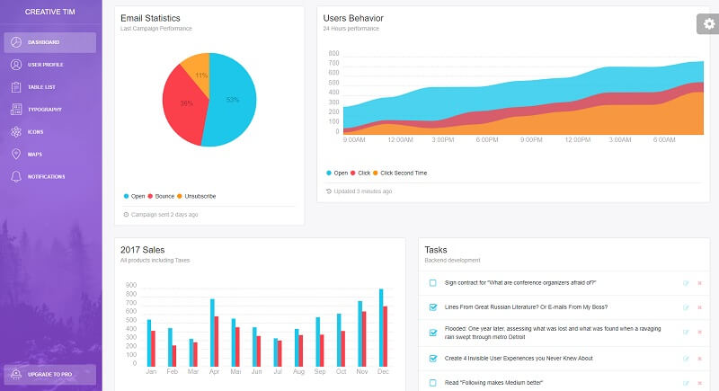

# Jinja Light Bootstrap

**Jinja Template** project generated by AppSeed on top of **Light Bootstrap Dashboard**,  a popular design crafted by Creative-Tim. The project is a super simple Flask project WITHOUT database, ORM, or any other hard dependency. **Light Bootstrap Dashboard** is a Bootstrap 4 admin dashboard template designed to be beautiful and simple. It is built on top of Bootstrap 4 and it is fully responsive.

> Features:

* Codebase: [Jinja Starter](../../boilerplate-code/boilerplate-jinja.md) 
* Render Engine: Flask / **Jinja2**
* Deployment scripts: Docker, Gunicorn/Nginx, HEROKU

> Links

* [Jinja Light Bootstrap Dashboard](https://github.com/app-generator/jinja-light-bootstrap) - source code
* [Jinja Light Bootstrap Dashboard](https://jinja-template-light-bootstrap.appseed.us/) - LIVE deployment  

> [Support](https://appseed.us/support) \(Email and LIVE on Discord\) for **registered** [**AppSeed**](https://appseed.us/) **users**.

### What is Jinja

[Jinja](https://jinja.palletsprojects.com/en/2.11.x/) is a modern and designer-friendly templating language for Python, modeled after Django’s templates. It is fast, widely used, and secure with the optional sandboxed template execution environment. Jinja is basically an engine used to generate HTML or XML returned to the user via an HTTP response. 

> Read more about [Jinja Template Language](../../content/what-is/jinja.md)

### How to use the App

* [Set up the environment](../../boilerplate-code/boilerplate-jinja.md#environment) - prepare your workstation
* [Compile source code](../../boilerplate-code/boilerplate-jinja.md#build-the-app) - start the project in the local environment
* [Codebase structure](../../boilerplate-code/boilerplate-jinja.md#codebase-structure) - explains how the project files are organized
* [Deployment](../../boilerplate-code/boilerplate-jinja.md#deployment): Docker and HEROKU 

### Light Bootstrap UI Kit

**Light Bootstrap Dashboard** contains multiple handpicked and optimized plugins. Everything is designed to fit with one another. It comes with a big collection of elements that will offer you multiple possibilities to create the app that best fits your needs.

* [Light Bootstrap Dashboard](../../content/bootstrap-template/light-bootstrap-dashboard.md) - more information provided by AppSeed
* [Light Bootstrap Dashboard](https://bit.ly/2ZEXOU3) - product page hosted by [Creative-Tim](../../content/partners/creative-tim.md)

