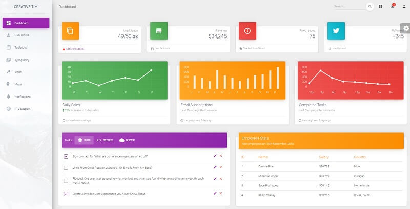

# Jinja Material Dashboard

**Jinja Template** project generated by AppSeed on top of **Material Dashboard**,  a popular design crafted by Creative-Tim. The project is a super simple Flask project WITHOUT database, ORM, or any other hard dependency. The starter can be used as a codebase for a future project or to migrate the **Jinja** files and assets to a legacy Python-based project that uses Jinja as the template engine \(Flask, Bottle, Django\).  

> Features:

* Codebase: [Jinja Starter](../../boilerplate-code/boilerplate-jinja.md)
* Render Engine: Flask / **Jinja2**
* Deployment scripts: Docker, Gunicorn/Nginx, HEROKU

> Links

* [Jinja Material Dashboard](https://github.com/app-generator/jinja-material-dashboard) - source code
* [Jinja Material  Dashboard](https://jinja-material-dashboard.appseed-srv1.com/) - LIVE deployment 

> [Support](https://appseed.us/support) \(Email and LIVE on Discord\) for **registered** [**AppSeed**](https://appseed.us/) **users**.

### What is Jinja

[Jinja](https://jinja.palletsprojects.com/en/2.11.x/) is a modern and designer-friendly templating language for Python, modeled after Django’s templates. It is fast, widely used, and secure with the optional sandboxed template execution environment. Jinja is basically an engine used to generate HTML or XML returned to the user via an HTTP response. 

> Read more about [Jinja Template Language](../../content/what-is/jinja.md)

### How to use the App

* [Set up the environment](../../boilerplate-code/boilerplate-jinja.md#environment) - prepare your workstation
* [Compile source code](../../boilerplate-code/boilerplate-jinja.md#build-the-app) - start the project in the local environment
* [Codebase structure](../../boilerplate-code/boilerplate-jinja.md#codebase-structure) - explains how the project files are organized
* [Deployment](../../boilerplate-code/boilerplate-jinja.md#deployment): Docker and HEROKU 

### [**Material Dashboard**](../../content/bootstrap-template/material-dashboard.md) **- UI Kit**

Material Dashboard is a free Material Bootstrap 4 Admin with a fresh, new design inspired by Google's Material Design. We are very excited to introduce our take on the material concepts through an easy-to-use and beautiful set of components. Material Dashboard was built over the popular Bootstrap 4 framework and it comes with a couple of third-party plugins redesigned to fit in with the rest of the elements.

* [Material Dashboard](../../content/bootstrap-template/material-dashboard.md) - information provided by AppSeed 
* [Material Dashboard](https://bit.ly/3fSPqaK) - product page hosted by [Creative-Tim](../../content/partners/creative-tim.md)

