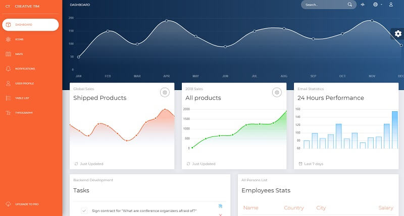

# Jinja Now UI Dashboard

**Jinja Template** project generated by AppSeed on top of **Now UI Dashboard**,  a popular design crafted by Creative-Tim. The project is a super simple Flask project WITHOUT database, ORM, or any other hard dependency. The starter can be used as a codebase for a future project or to migrate the **Jinja** files and assets to a legacy Python-based project that uses Jinja as the template engine \(Flask, Bottle, Django\).  

> Features:

* Codebase: [Jinja Starter](../../boilerplate-code/boilerplate-jinja.md)
* Render Engine: Flask / **Jinja2**
* Deployment scripts: Docker, Gunicorn/Nginx, HEROKU

> Links

* [Jinja Now UI Dashboard](https://github.com/app-generator/jinja-now-ui-dashboard) - source code
* [Jinja Now UI Dashboard](https://jinja-now-ui-dashboard.appseed-srv1.com/) - LIVE deployment 

> [Support](https://appseed.us/support) \(Email and LIVE on Discord\) for **registered** [**AppSeed**](https://appseed.us/) **users**.

### What is Jinja

[Jinja](https://jinja.palletsprojects.com/en/2.11.x/) is a modern and designer-friendly templating language for Python, modeled after Django’s templates. It is fast, widely used, and secure with the optional sandboxed template execution environment. Jinja is basically an engine used to generate HTML or XML returned to the user via an HTTP response. 

> Read more about [Jinja Template Language](../../content/what-is/jinja.md)

### How to use the App

* [Set up the environment](../../boilerplate-code/boilerplate-jinja.md#environment) - prepare your workstation
* [Compile source code](../../boilerplate-code/boilerplate-jinja.md#build-the-app) - start the project in the local environment
* [Codebase structure](../../boilerplate-code/boilerplate-jinja.md#codebase-structure) - explains how the project files are organized
* [Deployment](../../boilerplate-code/boilerplate-jinja.md#deployment): Docker and HEROKU 

### Now UI Dashboard - UI Kit

**Now UI Dashboard** is a responsive Bootstrap 4 kit provided for free by _**Invision**_ and _**Creative Tim**_. It combines colors that are easy on the eye, spacious cards, beautiful typography, and graphics. Now UI Dashboard comes packed with all plugins that you might need inside a project and documentation on how to get started. It is light and easy to use, and also very powerful.

* [Now UI Dashboard](https://www.creative-tim.com/product/now-ui-dashboard) - product page hosted by [Creative-Tim](../../content/partners/creative-tim.md)
* [Now UI Dashboard](https://demos.creative-tim.com/now-ui-dashboard/docs/1.0/getting-started/introduction.html) - product documentation

