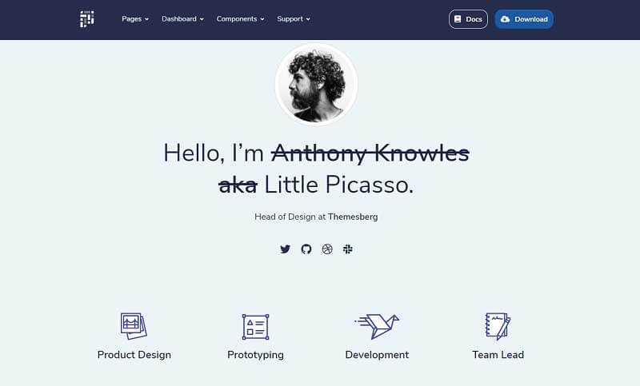

# Jinja Pixel Lite

Pixel is a free, fully responsive, and modern Bootstrap 4 UI Kit that will help you build creative and professional websites. Use our components and sections, switch some Sass variables to build and arrange pages to best suit your needs. The project is a super simple Flask project WITHOUT database, ORM, or any other hard dependency. 

> Features: 

* Codebase: [Jinja Starter](../../boilerplate-code/boilerplate-jinja.md) 
* Render Engine: Flask / **Jinja2**
* Deployment scripts: Docker, Gunicorn/Nginx, HEROKU

> Links

* [Jinja Pixel Lite](https://appseed.us/jinja-template/jinja-template-pixel-uikit) - product page
* [Jinja Pixel Lite](https://github.com/app-generator/jinja-pixel-lite) - source code
* [Jinja Pixel Lite](https://jinja-pixel-lite.appseed-srv1.com) - LIVE deployment 

> [Support](https://appseed.us/support) (Email and LIVE on Discord) for **registered **[**AppSeed**](https://appseed.us)** users**. 

### What is Jinja

[Jinja](https://jinja.palletsprojects.com/en/2.11.x/) is a modern and designer-friendly templating language for Python, modeled after Django’s templates. It is fast, widely used, and secure with the optional sandboxed template execution environment. Jinja is basically an engine used to generate HTML or XML returned to the user via an HTTP response. 

> Read more about [Jinja Template Language](../../content/what-is/jinja.md) 

### How to use the App

* [Set up the environment](../../boilerplate-code/boilerplate-jinja.md#environment) - prepare your workstation
* [Compile source code](../../boilerplate-code/boilerplate-jinja.md#build-the-app) - start the project in the local environment
* [Codebase structure](../../boilerplate-code/boilerplate-jinja.md#codebase-structure) - explains how the project files are organized
* [Deployment](../../boilerplate-code/boilerplate-jinja.md#deployment): Docker and HEROKU 

### Pixel Lite UI Kit

Pixel is a premium extension of the famous Bootstrap CSS Framework featuring pricing cards, profile cards, timelines, and many more. All components are created to comply as much as possible with the WCAG 2.1 standards.

* [Pixel Lite](../../content/bootstrap-template/pixel-lite-template.md) - information provided by AppSeed
* [Pixel Lite](https://themesberg.com/product/ui-kit/pixel-free-bootstrap-5-ui-kit) - product page hosted by [Themesberg](../../content/partners/themesberg.md)

