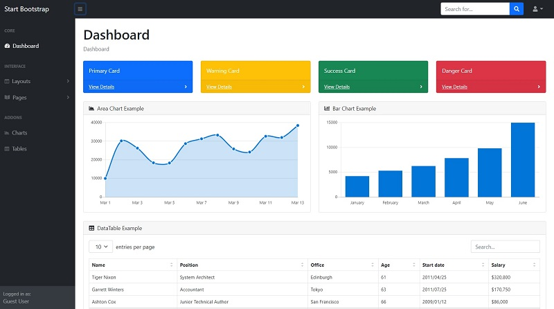

# Jinja SB Admin

**Jinja Template** project generated by AppSeed on top of **Sb Admin**,  the iconic dashboard template. The project is a super simple Flask project WITHOUT database, ORM, or any other hard dependency. The starter can be used as a codebase for a future project or to migrate the Jinja files and assets to a legacy Python-based project that uses Jinja as the template engine (Flask, Bottle, Django).

> Features:

* Codebase: [Jinja Starter](../../boilerplate-code/boilerplate-jinja.md) 
* Render Engine: Flask / **Jinja2**
* Deployment scripts: Docker, Gunicorn/Nginx, HEROKU

> Links

* [Jinja SB Admin](https://github.com/app-generator/jinja-sb-admin) - source code
* [Jinja SB Admin](https://jinja-sb-admin.appseed-srv1.com/) - LIVE deployment

> [Support](https://appseed.us/support) (Email and LIVE on Discord) for **registered** [**AppSeed**](https://appseed.us/) **users**.

## What is Jinja

[Jinja](https://jinja.palletsprojects.com/en/2.11.x/) is a modern and designer-friendly templating language for Python, modeled after Django’s templates. It is fast, widely used, and secure with the optional sandboxed template execution environment. Jinja is basically an engine used to generate HTML or XML returned to the user via an HTTP response.

> Read more about [Jinja Template Language](../../content/what-is/jinja.md)

## How to use the App

* [Set up the environment](../../boilerplate-code/boilerplate-jinja.md#environment) - prepare your workstation
* [Compile source code](../../boilerplate-code/boilerplate-jinja.md#build-the-app) - start the project in the local environment
* [Codebase structure](../../boilerplate-code/boilerplate-jinja.md#codebase-structure) - explains how the project files are organized
* [Deployment](../../boilerplate-code/boilerplate-jinja.md#deployment): Docker and HEROKU

## SB Admin UI

**SB Admin** is a free, open-source, Bootstrap 4 based admin theme perfect for quickly creating dashboards and web applications. It's modern design style with subtle shadows and a card-based layout could be described as flat material and is inspired by the principles of material design along with a simple, attractive color system.

* [SB Admin](https://startbootstrap.com/template/sb-admin) - product page
* [SB Admin](https://github.com/startbootstrap/startbootstrap-sb-admin) - source code (Github)

