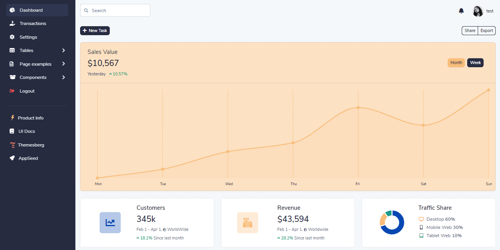

# Jinja Volt Bootstrap 5

**Jinja Template** project generated by AppSeed on top of **Volt Dashboard** (free version),  a popular design crafted by [Themesberg](../../content/partners/themesberg.md). The project is a super simple Flask project WITHOUT database, ORM, or any other hard dependency. The starter can be used as a codebase for a future project or to migrate the **Jinja** files and assets to a legacy Python-based project that uses Jinja as the template engine (Flask, Bottle, Django). 

> Features:

* Codebase: [Jinja Starter](../../boilerplate-code/boilerplate-jinja.md)
* Render Engine: Flask / **Jinja2**
* Deployment scripts: Docker, Gunicorn/Nginx, HEROKU

> Links

* [Jinja Volt Dashboard](https://github.com/app-generator/jinja-volt-dashboard) - source code
* [Jinja Volt Dashboard](https://jinja-volt-dashboard.appseed-srv1.com/) - LIVE deployment

> [Support](https://appseed.us/support) (Email and LIVE on Discord) for **registered** [**AppSeed**](https://appseed.us/) **users**.

## What is Jinja

[Jinja](https://jinja.palletsprojects.com/en/2.11.x/) is a modern and designer-friendly templating language for Python, modeled after Django’s templates. It is fast, widely used, and secure with the optional sandboxed template execution environment. Jinja is basically an engine used to generate HTML or XML returned to the user via an HTTP response.

> Read more about [Jinja Template Language](../../content/what-is/jinja.md)

## How to use the App

* [Set up the environment](../../boilerplate-code/boilerplate-jinja.md#environment) - prepare your workstation
* [Compile source code](../../boilerplate-code/boilerplate-jinja.md#build-the-app) - start the project in the local environment
* [Codebase structure](../../boilerplate-code/boilerplate-jinja.md#codebase-structure) - explains how the project files are organized
* [Deployment](../../boilerplate-code/boilerplate-jinja.md#deployment): Docker and HEROKU

## Volt Dashboard UI Kit

**100+ Components, 11 Sample pages** - more than 100 free Bootstrap 5 components included: buttons, alerts, modals, date pickers, all nicely documented via the official components docs. Volt brings 11 example pages including an overview, sign in, sign up, transactions page, and many more.

* [Volt Dashboard](https://themesberg.com/product/admin-dashboard/volt-bootstrap-5-dashboard) - product page hosted by Themesberg
* [Volt Dashboard](https://themesberg.com/docs/volt-bootstrap-5-dashboard/getting-started/quick-start/) - official documentation

