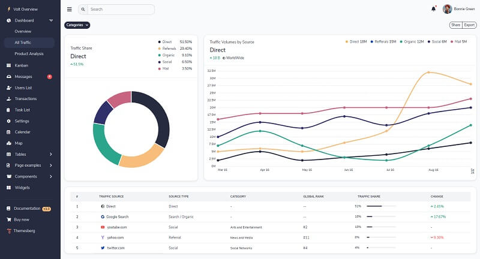

# Jinja Volt PRO

**Jinja Template** project generated by AppSeed on top of **Volt Dashboard PRO **(premium version),  a popular design crafted by [Themesberg](../../content/partners/themesberg.md). The project is a super simple Flask project WITHOUT database, ORM, or any other hard dependency. The starter can be used as a codebase for a future project or to migrate the **Jinja** files and assets to a legacy Python-based project that uses Jinja as the template engine (Flask, Bottle, Django).  

> Features: 

* Codebase: [Jinja Starter](../../boilerplate-code/boilerplate-jinja.md)
* Render Engine: Flask / **Jinja2**
* Deployment scripts: Docker, Gunicorn/Nginx, HEROKU

> Links

* [Jinja Volt PRO](https://appseed.us/jinja-template/jinja-template-volt-pro) - product page
* [Jinja Volt PRO](https://jinja-volt-pro.appseed-srv1.com) - LIVE deployment 

> [Support](https://appseed.us/support) (Email and LIVE on Discord) for **registered **[**AppSeed**](https://appseed.us)** users**. 

### What is Jinja

[Jinja](https://jinja.palletsprojects.com/en/2.11.x/) is a modern and designer-friendly templating language for Python, modeled after Django’s templates. It is fast, widely used, and secure with the optional sandboxed template execution environment. Jinja is basically an engine used to generate HTML or XML returned to the user via an HTTP response. 

> Read more about [Jinja Template Language](../../content/what-is/jinja.md) 

### How to use the App

* [Set up the environment](../../boilerplate-code/boilerplate-jinja.md#environment) - prepare your workstation
* [Compile source code](../../boilerplate-code/boilerplate-jinja.md#build-the-app) - start the project in the local environment
* [Codebase structure](../../boilerplate-code/boilerplate-jinja.md#codebase-structure) - explains how the project files are organized
* [Deployment](../../boilerplate-code/boilerplate-jinja.md#deployment): Docker and HEROKU

### Volt PRO - UI Kit

Volt Pro comes with 20 example pages including the overview page, kanban drag and drop page, messages, user settings, transactions, calendar, sign in, sign up, and many more pages. 

There are at least 10 lightweight Vanilla JS plugin libraries that we have customized and expanded in terms of features that you can use for your application. Some of these are a calendar, SVG maps, date pickers, notifications, drag and drop file uploads. 

* [Volt PRO](../../content/bootstrap-template/volt-dashboard-pro.md) - more information provided by AppSeed
* [Volt PRO ](https://themesberg.com/product/admin-dashboard/volt-premium-bootstrap-5-dashboard)- product page hosted by [Themesberg](../../content/partners/themesberg.md)

