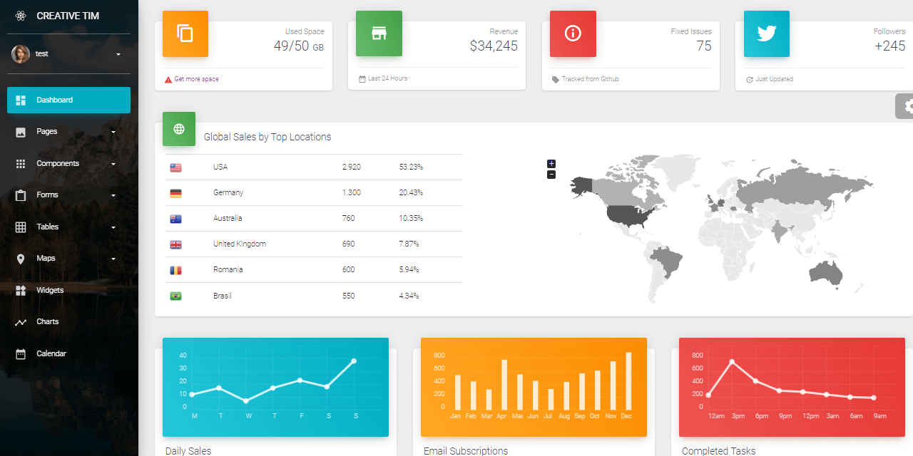
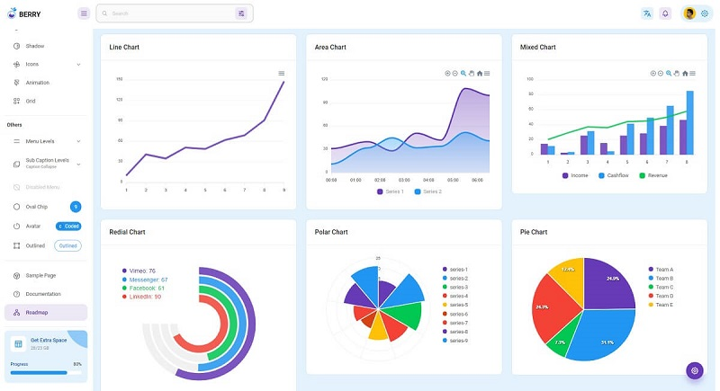

# React

This page contains all full-stack products crafted by AppSeed using a React frontend.&#x20;

* [React Node JS Berry](node-js-berry-dashboard.md) - open-source starter with a Material-UI design
* [React Node JS Datta Able](node-js-datta-able.md) - a colorful full-stack dashboard
* [React Firebase Datta Able](firebase-datta-able.md) - full-stack product with Firebase backend
* [Django React Datta Able](django-datta-able.md) - full-stack product with Django backend

###

### [Full-stack React Material PRO](../full-stack/react-material-dashboard.md)

Full-stack version of **React Material Dashboard**, a premium design crafted by **Creative-Tim** now usable with multiple API Backend Servers: **Node JS**, Flask, Django. The UI comes with pre-configured **JWT authentication** powered by a [Unified API Interface](../../boilerplate-code/api-server/api-unified-definition.md) that makes this product compatible with more than one backend: Node JS, Flask, Django.&#x20;

* [Full-stack React Material Dashboard](https://appseed.us/full-stack/react-material-dashboard) - product page
* [Full-stack React Material Dashboard](https://fullstack-react-material-dashboard.appseed-srv1.com/) - LIVE Demo

###

### [Full-stack React Datta Able PRO](../full-stack/react-datta-able.md)

Full-stack version of **Datta Able PRO**, a premium design crafted by **CodedThemes** now usable with multiple API Backend Servers: **Node JS**, Flask, Django. Datta Able React is the **most stylized** React **Admin Template**, around all other admin templates **in the market**. It comes with high feature-rich pages and components with **fully developer-**centric code. &#x20;

* [Full-stack React Datta Able](https://appseed.us/full-stack/react-datta-able) - product page
* [Full-stack React Datta Able](https://fullstack-react-datta-able.appseed-srv1.com/) - LIVE Demo

 (1) (1) (1) (1) (1) (1) (1) (1) (1) (1) (2) (1).jpg>)

###

### [Full-stack React Berry PRO](../full-stack/react-berry-dashboard.md)

**Berry** is `developer-friendly` & highly customizable React Admin Template based on [Material-UI](http://material-ui.com/).  This modern design comes with plenty of ready-to-use Material-UI components that will help you to build your site faster and saves your development time. The UI comes with pre-configured **JWT authentication** powered by a [Unified API Interface](../../boilerplate-code/api-server/api-unified-definition.md) that makes this product compatible with more than one backend: Node JS, Flask, Django (FASTapi coming soon). &#x20;

* [Full-stack React Berry Dashboard](https://appseed.us/full-stack/react-berry-dashboard) - product page
* [Full-stack React Berry Dashboard](https://fullstack-react-berry-dashboard.appseed-srv1.com/) - LIVE Demo
* [UI Docs](https://codedthemes.gitbook.io/berry/) - provided by CodedThemes

