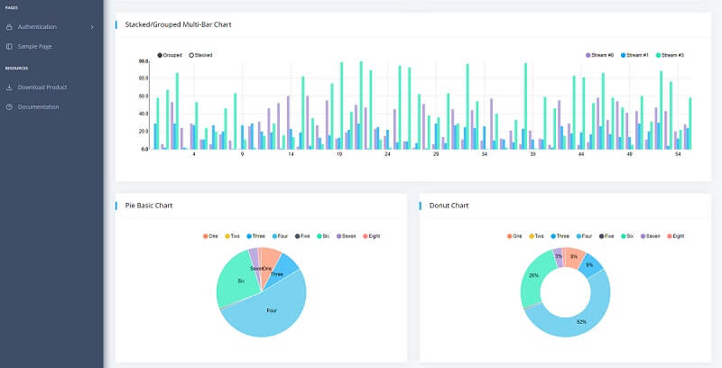

# Django React Datta Able

Open-source full-stack seed project coded in [**React** and **Django**](https://appseed.us/product/django-react-datta-able) on top of a modern design from **CodedThemes**. The **React** / **Django** codebase is already configured with an SQLite database, API, and JWT token-based authentication flow.

* [Django React Datta Able](https://appseed.us/product/django-react-datta-able) - product page
* [Django React Datta Able](https://django-react-datta-able.appseed-srv1.com/) - LIVE demo
* [Django React Datta PRO](django-datta-able-pro.md) - the premium version



### Product features

The product expects a running API backend that exposes an interface for login/logout and register actions. By default, the guest users are redirected to the login page. Once the user is authenticated using an existing account or the new one, all private pages are accessible. Here are the steps to compile the product.&#x20;

> Dependencies

To use the product, **Python3** is required, and **GIT** command-line tool to clone/download the project from the public repository.

> &#x20;**Step #1** - Clone the project

```bash
$ git clone https://github.com/app-generator/react-datta-able-dashboard.git
$ cd react-datta-able-dashboard 
```

> **Step #2** - Install dependencies via NPM or yarn

```bash
$ npm i
// OR
$ yarn 
```

> &#x20;**Step #3** - Start in development mode

```bash
$ npm run start 
// OR
$ yarn start 
```

> **Step #4** - Configure the backend - `src/config.js`

```javascript
const config = {
    ...
    API_SERVER: 'http://localhost:5000/api/'  // <-- The magic line
}; 
```

###

### Django API Server

To use the product and see all features in action an API server should be up and running. This can be done in two ways:

* Compile and start a simple [**Django API Server**](../../boilerplate-code/api-server/django.md) already built to work with this frontend
* Mock a test server using the [**API Interface**](../../boilerplate-code/api-server/api-unified-definition.md) definition.


Here we will use the first option and build a real API server coded in **Django Framework** on top of [DRF](https://www.django-rest-framework.org/) Library with SQLite persistence.

> &#x20;**Step #1** - Clone the API Server from Github

```
$ git clone https://github.com/app-generator/api-server-django.git
$ cd api-server-django 
```

> **Step #2** - Install dependencies

```
$ virtualenv -p python3 venv
$ source venv/bin/activate 
$
$ pip install -r requirements.txt
```

> **Step #3** - Start the APi Server

```
$ python manage.py migrate
$ python manage.py runserver 5000 
```

The API server will start using the default port `5000`.

With backend and frontend up & running, we can start using the product, register. and authenticate. The React UI will reveal the private pages once the users are authenticated.&#x20;

.jpg>)
