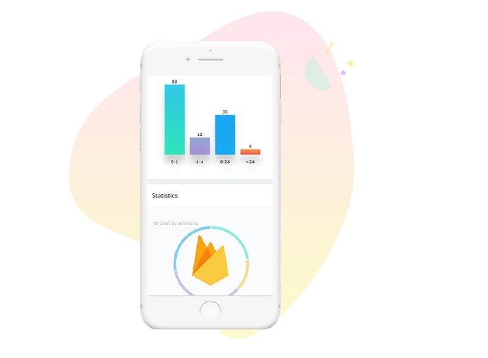

# React Firebase Datta Able

Open-source full-stack seed project coded in **React** and **Firebase** on top of a modern design from **CodedThemes**. The React / Firebase codebase is already configured with social login (Google)

* [React Firebase Datta Able](https://appseed.us/product/react-firebase-datta-able) - product page
* [React Firebase Datta Able](https://react-firebase-datta-able.appseed-srv1.com/) - LIVE demo
* [React Firebase Datta Able](https://github.com/app-generator/react-firebase-datta-able) - Source Code



### Product features

The product expects a configured **Firebase backend** that exposes the required configuration. By default, the guest users are redirected to the login page. Once the user is authenticated using an existing account or Google social login, all private pages are accessible.

> Dependencies

To use the product, a decent version of **Node JS** (>= 12.x) is required, and **GIT** command-line tool to clone/download the project from the public repository.

> &#x20;**Step #1** - Clone the project

```bash
$ git clone https://github.com/app-generator/react-firebase-datta-able.git
$ cd react-firebase-datta-able
```

> **Step #2** - Install dependencies via NPM or yarn

```bash
$ npm i
// OR
$ yarn 
```

> &#x20;**Step #3** - Configure Firebase Credeintials - `src/config/constant.js` &#x20;

```javascript
const config = {
    ...
    firebase: {                                               
        apiKey: 'YOUR_API_KEY',                            # <-- YOUR DATA HERE
        authDomain: 'YOUR_DOMAIN_HERE',                    # <-- YOUR DATA HERE 
        projectId: 'YOUR_PROJECT_ID',                      # <-- YOUR DATA HERE
        storageBucket: 'YOUR_STORAGE_BUCKET',              # <-- YOUR DATA HERE
        messagingSenderId: 'YOUR_MESSAGING_SENDER_ID',     # <-- YOUR DATA HERE
        appId: 'YOUR_APP_ID',                              # <-- YOUR DATA HERE
        measurementId: 'YOUR_TRACKER_ID'                   # <-- YOUR DATA HERE
    }
};
```

> **Step #4** - Start in development mode

```bash
$ npm run start 
// OR
$ yarn start 
```

All above settings are provided by the Firebase platform. For more information, feel free to access [Firebase official](https://firebase.google.com/docs) help:

* [Firebase Fundamentals](https://firebase.google.com/docs/guides) - Learn how to get started fast
* [Manage Projects in Firebase](https://firebase.google.com/docs/projects/learn-more) - the basics&#x20;
