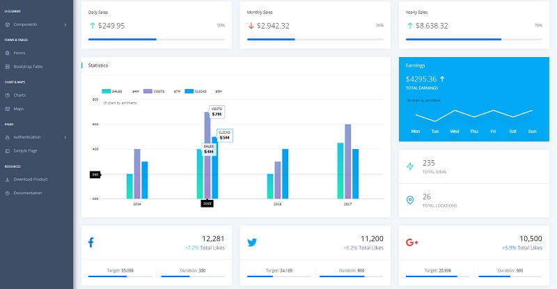

# Flask React Datta Able

Open-source full-stack seed project coded in **React** and **Flask** on top of a modern design from **CodedThemes**. The **React** / **Flask** codebase is already configured with an SQLite database, API, and JWT token-based authentication flow.

* [Flask React Datta Able](https://appseed.us/product/flask-react-datta-able) - product page
* [Flask React Datta Able](https://flask-react-datta-able.appseed-srv1.com) - LIVE demo




## Product features

The product expects a running API backend that exposes an interface for login/logout and register actions. By default, the guest users are redirected to the login page. Once the user is authenticated using an existing account or the new one, all private pages are accessible. Here are the steps to compile the product.

> Dependencies

To use the product, **Python3** is required, and **GIT** command-line tool to clone/download the project from the public repository.

> **Step #1** - Clone the project

```bash
$ git clone https://github.com/app-generator/react-datta-able-dashboard.git
$ cd react-datta-able-dashboard 
```

> **Step #2** - Install dependencies via NPM or yarn

```bash
$ npm i
// OR
$ yarn 
```

> **Step #3** - Start in development mode

```bash
$ npm run start 
// OR
$ yarn start 
```

> **Step #4** - Configure the backend - `src/config.js`

```javascript
const config = {
    ...
    API_SERVER: 'http://localhost:5000/api/'  // <-- The magic line
}; 
```


## Flask API Server

To use the product and see all features in action an API server should be up and running. This can be done in two ways:

* Compile and start a simple [**Flask API Server**](https://docs.appseed.us/boilerplate-code/api-server/flask) already built to work with this frontend
* Mock a test server using the [**API Interface**](../../boilerplate-code/api-server/api-unified-definition.md) definition.

.png>)

Here we will use the first option and build a real API server coded in **Flask Framework** on top of Flask-RestX Library with SQLite persistence.

> **Step #1** - clone the project using GIT

```
$ git clone https://github.com/app-generator/api-server-flask.git
$ cd api-server-flask
```

> **Step #2** - Install dependencies (using a virtual environment)

```
$ # Virtualenv modules installation (Unix based systems)
$ virtualenv env
$ source env/bin/activate
$
$ # Virtualenv modules installation (Windows based systems)
$ # virtualenv env
$ # .\env\Scripts\activate
```

Install dependencies in once the `virtualenv`  is activated

```
$ pip install -r requirements.txt
```

> **Step #3** - Prepare the environment

```
$ export FLASK_APP=run.py
$ export FLASK_ENV=development
```

> Or for Windows-based systems

```
$ (Windows CMD) set FLASK_APP=run.py
$ (Windows CMD) set FLASK_ENV=development
$
$ (Powershell) $env:FLASK_APP = ".\run.py"
$ (Powershell) $env:FLASK_ENV = "development"
```

> **Step #4** - Initialize the database, check `run.py` for shell context

```
$ flask shell
>>> from api import db
>>> db.create_all()
```

> **Step #5** - Start the API server

```
$ python run.py
// OR
$ flask run
```

Visit `http://localhost:5000` in your browser. The API server will be running.

With backend and frontend up & running, we can start using the product, register. and authenticate. The React UI will reveal the private pages once the users are authenticated.

.png>)
