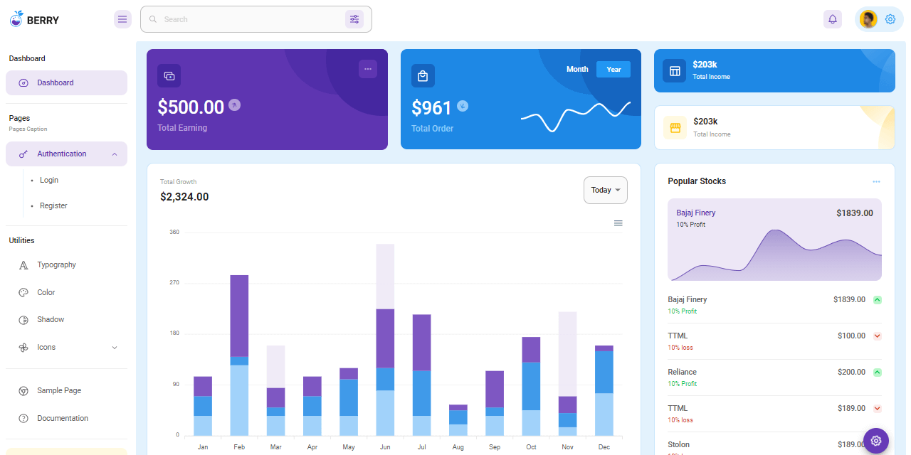
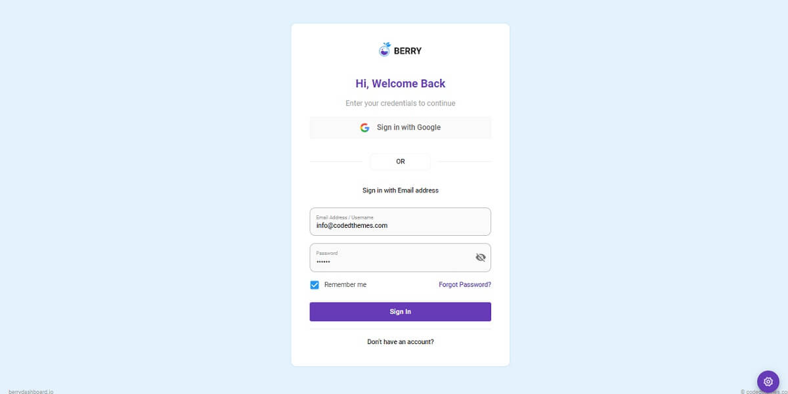

# React Node JS Berry

Open-source full-stack seed project coded in **React** and **Node JS** on top of a modern **Material UI** design from **CodedThemes**. The React / NodeJS codebase is already configured with a SQLite database, API, JWT authentication flow powered by `Passport` library.

> Features

* Modern aesthetics UI design - Designed by _CodedThemes_
* React, Redux, Redux-persist
* Authentication: JWT Login/Register/Logout
* Full-stack ready using a **Node JS API Server** (open-source project) - Server Features
  * `Typescript` / SQLite Persistence / TypeORM / Joy (validation)
  * Passport library - `passport-jwt` strategy.

> Links

* [React Node JS Berry](https://appseed.us/product/react-node-js-berry-dashboard) - product page
* [React Node JS Berry](https://react-node-js-berry-dashboard.appseed-srv1.com) - LIVE Demo
* Free Support via Github (issues tracker) and [Discord](https://discord.gg/fZC6hup).
* Related Products:
  * **PRO Version**: [Full-Stack React Berry PRO](https://appseed.us/full-stack/react-berry-dashboard)
  * Django API Backend - [Django React Berry](https://appseed.us/product/django-react-berry-dashboard) - `open-source` project
  * Flask API Backend - [Flask React Berry](https://appseed.us/product/flask-react-berry-dashboard) - `open-source` project



## How to use the App

The product expects a running API backend that exposes an interface for `login`/`logout` and `register` actions. By default, the guest users are redirected to the login page. Once the user is authenticated all private pages are accessible. Here are the steps to compile the product.

> Dependencies

To use the product, a decent version of **Node JS** (>= 12.x) is required, and **GIT** command-line tool to clone/download the project from the public repository.

> **Step #1** - Clone the project

```bash
$ git clone https://github.com/app-generator/react-berry-dashboard.git
$ cd react-berry-dashboard
```

> **Step #2** - Install dependencies via NPM or yarn

```bash
$ npm i
// OR
$ yarn 
```

> **Step #3** - Start in development mode

```bash
$ npm run start 
// OR
$ yarn start 
```

> **Step #4** - Configure the backend - `src/config.js`

```javascript
const config = {
    ...
    API_SERVER: 'http://localhost:5000/api/'  // <-- The magic line
}; 
```

## API Server

To use the product and see all features in action, an API server should be up and running. This can be done in two ways:

* Compile and start a [Node JS API Server](https://github.com/app-generator/api-server-nodejs) already built to work with this frontend
* Mock a test server using the [API Interface](https://github.com/app-generator/api-server-nodejs/blob/master/media/api.postman\_collection.json) definition

Here, we will use the first version and build a real API server coded in Node JS/Express and SQLite persistence.

> API Server Description

Express / Nodejs Starter with JWT authentication, MongoDB where authentication is based on [json web tokens](https://jwt.io). `passport-jwt` strategy is used to handle the Email/Password authentication. After a successful login, the generated token is sent to the requester.

> Dependencies

* [Node.js](https://nodejs.org) >= 12.x
* GIT: `command-line` utility

> **Step #1** - Clone the API Server from Github

```bash
$ git clone https://github.com/app-generator/api-server-nodejs.git
$ cd api-server-nodejs 
```

> **Step #2** - Install dependencies via NPM or yarn

```bash
$ npm i
// OR
$ yarn 
```

> **Step #3** - Run the SQLite migration via `TypeORM`

```bash
$ yarn typeorm migration:run 
```

> **Step #3** - Start in development mode

```bash
$ npm dev
// OR
$ yarn dev 
```

The API server will start using the `PORT` specified in `.env` file, default value `5000`, same as the one expected by the front end.

From this point, the React Product should be able to authenticate and register new users.



## Resources

* [React Apps](https://appseed.us/apps/react) - seed projects provided by AppSeed
* Free [Support](https://appseed.us/support) via eMail and [Discord](https://discord.gg/fZC6hup)
