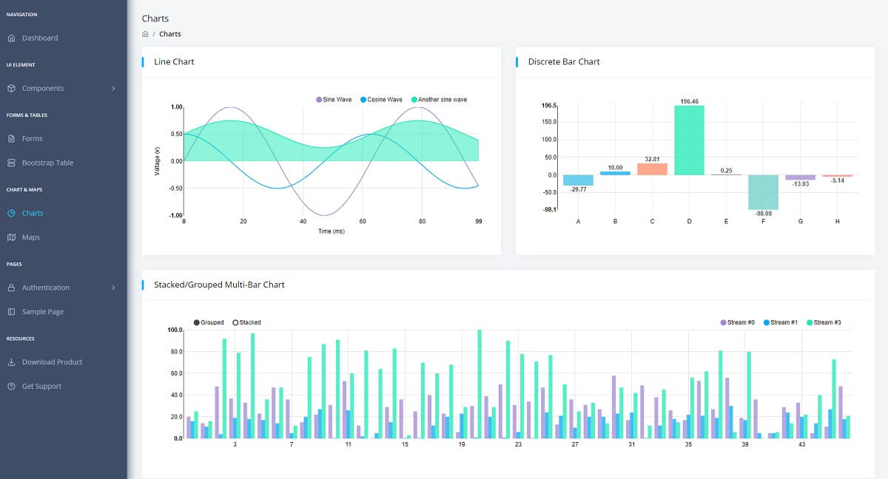
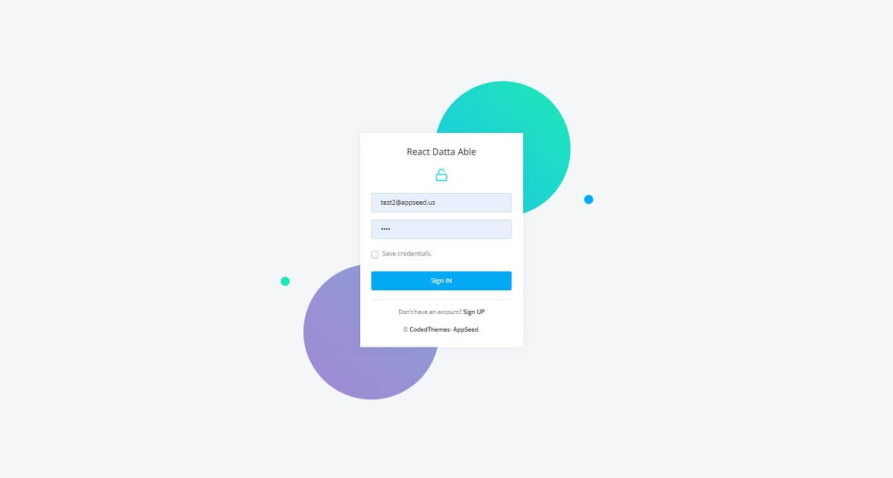

# React Node JS Datta Able

Open-source full-stack seed project coded in **React** and **Node JS** on top of a modern design from **CodedThemes**. The React / NodeJS codebase is already configured with a Mongo database, API, and authentication flow.

* [React Node JS Datta Able](https://appseed.us/product/react-node-js-datta-able) - product page
* [React Node JS Datta Able](https://react-node-js-datta-able.appseed-srv1.com/) - LIVE demo
* [React Node JS Datta PRO](node-js-datta-able-pro.md) - Premium Version (more pages and components)



### Product features

The product expects a running API backend that exposes an interface for login/logout and register actions. By default, the guest users are redirected to the login page. Once the user is authenticated using an existing account or the new one, all private pages are accessible. Here are the steps to compile the product.&#x20;

> Dependencies

To use the product, a decent version of **Node JS** (>= 12.x) is required, and **GIT** command-line tool to clone/download the project from the public repository.

> &#x20;**Step #1** - Clone the project

```bash
$ git clone https://github.com/app-generator/react-datta-able-dashboard.git
$ cd react-datta-able-dashboard 
```

> **Step #2** - Install dependencies via NPM or yarn

```bash
$ npm i
// OR
$ yarn 
```

> &#x20;**Step #3** - Start in development mode

```bash
$ npm run start 
// OR
$ yarn start 
```

> **Step #4** - Configure the backend - `src/config.js`

```javascript
const config = {
    ...
    API_SERVER: 'http://localhost:5000/api/'  // <-- The magic line
}; 
```


### API Server

To use the product and see all features in action an API server should be up and running. This can be done in two ways:

* Compile and start a simple [Node JS API](https://github.com/app-generator/api-server-nodejs) already built to work with this frontend
* Mock a test server using the [API Interface](https://github.com/app-generator/api-server-nodejs/blob/master/media/api.postman\_collection.json) definition

Here we will use the first version and build a real API server coded in Node JS/Express and MongoDB.&#x20;

> API Server Description&#x20;

Express / Nodejs Starter with JWT authentication, MongoDB where authentication is based on [json web tokens](https://jwt.io/). `passport-jwt` strategy is used to handle the Email/Password authentication. After a successful login, the generated token is sent to the requester.

> Dependencies&#x20;

* [Node.js](https://nodejs.org/) >= 12.x
* [MongoDB](https://www.mongodb.com/) server&#x20;

> &#x20;**Step #1** - Clone the API Server from Github

```bash
$ git clone https://github.com/app-generator/api-server-nodejs.git
$ cd api-server-nodejs 
```

> **Step #2** - Install dependencies via NPM or yarn

```bash
$ npm i
// OR
$ yarn 
```

> &#x20;**Step #3** - Start in development mode

```bash
$ npm dev
// OR
$ yarn dev 
```

The API server will start using the `PORT` specified in `.env` file, default value `5000` , same as the one expected by the front end.

From this point, the React Product should be able to authenticate and register new users.&#x20;



### Resources&#x20;

* [React Node JS Datta Able](https://appseed.us/product/react-node-js-datta-able) - product page
* [React Node JS Datta Able](https://github.com/app-generator/react-datta-able-dashboard) - source code
* Free [Support](https://appseed.us/support) via eMail and **Discord** (for registered users)&#x20;
