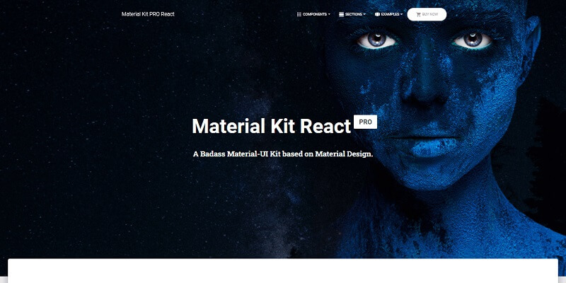
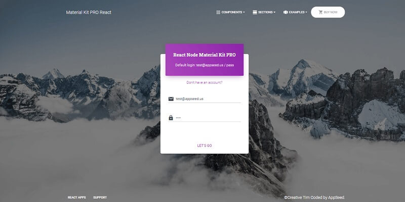
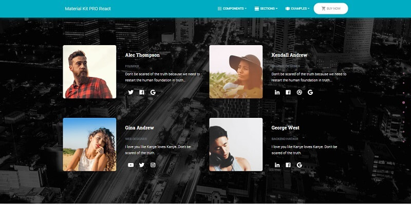

# React Node Material Kit PRO

Full-stack version of **React Material UI Kit**, a premium design crafted by **Creative-Tim** powered by a Node JS API backend server. The UI comes with pre-configured **JWT authentication** powered by a [Unified API Interface](../../boilerplate-code/api-server/api-unified-definition.md) that makes this product compatible with more than one backend: **Node JS**, Flask, Django (FASTapi coming soon).

* [React Node Material Kit PRO](https://appseed.us/product/react-node-js-material-kit-pro) - product page
* [React Node Material Kit PRO](https://react-node-js-material-kit-pro.appseed-srv1.com/) - LIVE Demo




## Product features

The product expects a **running API backend** that exposes an interface for login/logout and register actions. By default, the guest users are redirected to the login page. Once the user is authenticated using an existing account or the new one, all private pages are accessible. Here are the steps to compile the product.

> Dependencies

To use the product, a decent version of **Node JS** (>= 12.x) is required, and **GIT** command-line tool to clone/download the project from the public repository.

> **Step #1** - Clone the project (private repository)

```bash
$ git clone https://github.com/app-generator/priv-react-material-kit-pro.git
$ cd priv-react-material-kit-pro
```

> **Step #2** - Install dependencies via NPM or yarn

```bash
$ npm i
// OR
$ yarn 
```

> **Step #3** - Start in development mode

```bash
$ npm run start 
// OR
$ yarn start 
```

> **Step #4** - Configure the backend - `src/config/constant.js`

```javascript
export const API_SERVER = "http://localhost:5000/api/";
```


## Build API Server

The product is shipped with a premium Node JS API built with Express, JWT authentication, and SQLite or MongoDB persistence. Authentication Flow uses `json web tokens` powered by Passport library - `passport-jwt`.

> Features

* Simple, intuitive codebase - can be extended with ease.
* Typescript, Data validation with Joy
* Branches:
  * **Master**: NodeJS / Express / SQLite / TypeORM
  * **Mongo**: NodeJS / Express / MongoDB / Mongoose
* Auth: Passport / `passport-jwt` strategy

#### How to use the code

**Step #1** - Clone the project (private repository)

```
$ git clone https://github.com/app-generator/priv-api-server-nodejs.git
$ cd priv-api-server-nodejs
```

**Step #2** - Install dependencies via NPM or yarn

```
$ npm i
// OR
$ yarn
```

**Step #3** - Run the SQLite migration via TypeORM

```
$ yarn typeorm migration:run
```

**Step #4** - Start the API server (development mode)

```
$ npm dev
// OR
$ yarn dev
```

**Step #5** - Production Build (files generated in `build` directory)

```
$ npm build
// OR
$ yarn build
```

**Step #6** - Start the API server for production (files served from `build/index.js`)

```
$ npm start
// OR
$ yarn start
```

The API server will start using the `PORT` specified in `.env` file (default 5000).


Once both projects (frontend and backend) are up and running, we should see the login page prompted by the React UI. To pass the authentication and access the private page we need to create a new user via the registration page.



> React Node JS Material Kit - Team cards


