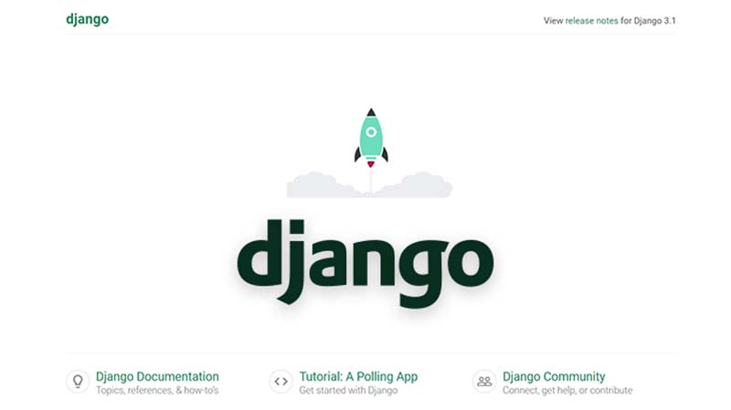

# Django Create Model

This page explains **how to create and USE a model in Django**. All commands used to code the project and also the relevant updates are listed below. For newcomers, **Django** is a high-level Python Web framework that encourages rapid development and clean, pragmatic design. Built by experienced developers, it takes care of much of the hassle of Web development, so you can focus on writing your app without needing to reinvent the wheel. 

> Resources

* [Django Create Model](https://github.com/app-generator/django-create-model) - the source code (Github/MIT License)
* More [Django Samples](https://appseed.us/admin-dashboards/django) provided with authentication, basic modules

> [Support](https://appseed.us/support) (Email and LIVE on Discord) for **registered **[AppSeed](https://appseed.us)** users**. 


### How to code this sample

This sample can be coded from scratch by following the steps below.  

> Check [Python](../../content/what-is/python.md) Version

```
$ python --version
Python 3.8.4 <-- All good
```

>  Create/activate a virtual environment - Unix-based system

```
$ # Virtualenv modules installation
$ virtualenv env
$ source env/bin/activate  
```

For Windows, the syntax is slightly different

```
$ # virtualenv env
$ # .\env\Scripts\activate
```

>  Install Django (the latest stable version)

```
$ pip install django
```

>  Create a new Django Project

```
$ mkdir django-sample-urls
$ cd django-sample-urls
```

 Inside the new directory, we will invoke `startproject` subcommand

```
$ django-admin startproject config .
```

**Note**: Take into account that `.` at the end of the command.

> Setup the database

```
$ python manage.py makemigrations
$ python manage.py migrate
```

> Start the app

```
$ python manage.py runserver 
$
$ # Access the web app in browser: http://127.0.0.1:8000/
```

At this point we should see the default Django page in the browser: 



>  Create a new Django app

```
$ python manage.py startapp sample
```

>  **Visualize the default SQL settings** - `config/settings.py`

```python
# File: config/settings.py (partial content)
...
DATABASES = {
    'default': {
        'ENGINE': 'django.db.backends.sqlite3',
        'NAME': BASE_DIR / 'db.sqlite3',
    }
}
... 
```

**Define a new model** `Books` in `sample` application. The below changes should be added to `sample/models.py`:

```python
# File: sample/models.py

from django.db import models                       

class Book(models.Model):                                 # <- NEW
    title            = models.CharField(max_length=100)   # <- NEW 
    author           = models.CharField(max_length=100)   # <- NEW
    publication_date = models.DateField()                 # <- NEW 

```

 **Tip** - for a quick check over the latest changes we can run `check` subcommand.

```
$ python manage.py check
System check identified no issues (0 silenced).  
```

 **Generate the SQL code** (`migrate` the database).

```
$ python manage.py makemigrations  # generate the SQL code
Migrations for 'sample':
  sample\migrations\0001_initial.py
    - Create model Book 
```

**Apply changes on the database**

```
$ python manage.py migrate
Operations to perform:
  Apply all migrations: admin, auth, contenttypes, sample, sessions
Running migrations:
  Applying sample.0001_initial... OK 
```

**Use the model via CLI**

Once the model is created we can use it via the Django shell:

```python
$ python manage.py shell
>>> 
>>> from sample.models import Book     # import the Book model in our context
>>> from django.utils import timezone  # used to provide the value for publication_date
>>>
>>> book1 = Book(title='The Adventures of Tom Sawyer', author='Mark Twain', publication_date=timezone.now() )
>>> book1.save()                       # save the new book

```

 **List all books** (using the CLI)

```python
$ python manage.py shell
>>> 
>>> from sample.models import Book
>>> Book.objects.all()
<QuerySet [<Book: Book object (1)>]>
```

We can see our new book returned by the query. Let's improve the information that describes the object.

**Django Model** - add text representation of an object

To achieve this goal, we should define the `__str__()` method for the `Book` model

```python
# File: sample/models.py

from django.db import models                       

class Book(models.Model): 
    title            = models.CharField(max_length=100) 
    author           = models.CharField(max_length=100)
    publication_date = models.DateField() 

    def __str__(self):       # <- NEW
        return self.title    # <- NEW

```

Let's restart the Django console and check the results:

```python
$ python manage.py shell
>>> 
>>> from sample.models import Book
>>> Book.objects.all()
<QuerySet [<Book: The Adventures of Tom Sawyer>]>

```

**Use the model via Admin Section**

Django comes with an `admin` section _out-of-the-box_ that allows us to manage with ease all models defined in the project. To manage the `Book` model in the administration console we need to create a `superuser` (aka the admin) and after `register` the `Book` model to be visible in the admin section.

> Create the superuser

```
$ python manage.py createsuperuser
sername (leave blank to use 'sm0ke'): admin
Email address: admin@appseed.us
Password: 
Password (again):
Superuser created successfully. 
```

>  Register `Book` model to be visible in the `admin` section - Edit `sample/admin.py` as below:

```python
# File: sample/admin.py

from django.contrib import admin

from .models import Book        # <- NEW

admin.site.register(Book)       # <- NEW 
```

> Authenticate as admin - `http://localhost:8000/admin/`

At this point, we should see the `Books` model in the UI and able to execute CRUD operations.

.png>)

.png>)

.png>)


### Resources

* Read more about [Django](https://www.djangoproject.com) (official docs)
* Start fast a new project using _development-ready _[Django Starters](https://appseed.us/admin-dashboards/django) 
