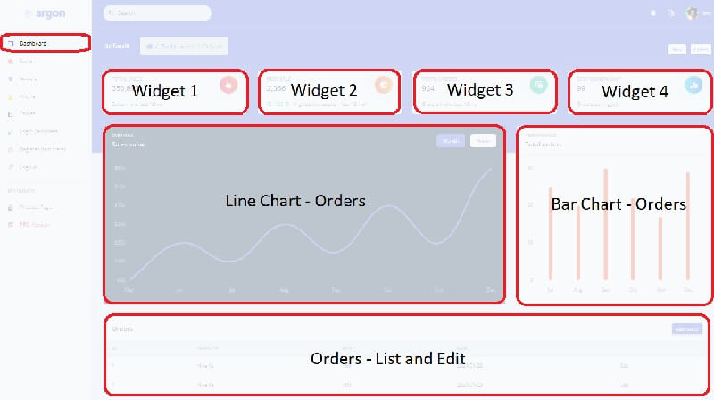

# Django Sales Charts

&#x20;Open-source Sample provided on top of [**Argon Dashboard Django**](https://bit.ly/3si4e7q) (free product). **Django Argon Charts** sample provides functional code that shows different metrics regarding a 12mo timeframe: total sales, total orders, best sale, and best month (in sales value). Information is provided using charts, widgets and a paginated data table that allows editing/adding new sales - **App Features:**&#x20;

* Manage orders and display the information visually using charts and widgets
* Table `Orders` store the information - properties:
  * ID, Product Name (mandatory), Price, Created Times, Updated Times.
* `Charts`: Line and Bar Charts:
  * `Line Chart` shows the sales for a 12mo timeframe
  * `Bar Chart` shows the sales for a 12mo timeframe
* `Widget 1`: Total Sales (in value)
* `Widget 2`: Peek Sale - transaction with Biggest Value
* `Widget 3`: Total Orders (sum up of all transactions)
* `Widget 4`: Best Month - selected by the number of orders

> Links

* [Django Argon Charts](https://django-argon-charts.appseed-srv1.com/) - LIVE deployment
* [Django Graphs and Charts](https://www.creative-tim.com/blog/django-templates/django-graphs-charts-argon-dashboard/) - a comprehensive blog article
* [Argon Dashboard Django](https://bit.ly/3si4e7q) - the original starter




### How to use the app

To compile and execute the project in a local environment the workstation must have a few software tools already installed:&#x20;

* [GIT](https://git-scm.com/) - command line versioning tool used to clone the sources&#x20;
* [Python3](https://www.python.org/) - the language used to code the project &#x20;

&#x20;

**Step #1 - Clone the sources**

```
$ # Get the code
$ git clone https://github.com/app-generator/django-argon-charts.git
$ cd django-argon-charts
```

**Step #2 - Prepare the environment** and install modules

```
$ virtualenv env
$ source env/bin/activate
$
$ # Install modules
$ pip3 install -r requirements.txt
```

**Step #3 - Create SQLite database** and tables

```
$ python manage.py makemigrations
$ python manage.py migrate
```

**Step #4 - Create the superuser**

```
$ python manage.py createsuperuser 
```

****

**Start the app**, access the `admin` section and import the [Sample File](https://github.com/app-generator/django-argon-charts/blob/master/media/sample\_data/orders.csv) into the `orders` table.

> Note: make sure your are connected with an `admin` account.


### Codebase Structure

```
< PROJECT ROOT >
   |
   |-- core/                      # Implements app logic 
   |    |-- settings.py           # Django app bootstrapper
   |    |-- static/
   |    |-- templates/            # Templates used to render pages
   |
   |-- authentication/            # Handles auth routes (login and register)
   |    |-- urls.py               # Define authentication routes  
   |    |-- forms.py              # Define auth forms  
   |
   |-- app/                       # A simple app that serve HTML files
   |    |-- views.py              # Serve HTML pages for authenticated users
   |    |-- templates
   |         |-- dashboard.html   # The dashboard <-------- NEW 
   |
   |-- orders/                    # Handles and display ORDERS   <-------- NEW   
   |    |-- migrations/           # Handles and display ORDERS   <-------- NEW
   |    |   |-- __init__.py
   |    |-- static/               # order CSS files, JS, and static images
   |    |   |-- orders_assets/
   |    |       | -- jquery/
   |    |       |-- js/
   |    |           |-- order_script.js
   |    |           |-- notify.js
   |    |-- templates/         
   |    |   |-- orders/
   |    |-- __init__.py        # Defines App init             <-------- NEW
   |    |-- admin.py           # Defines App admin            <-------- NEW
   |    |-- apps.py            # Defines App apps             <-------- NEW
   |    |-- forms.py           # Defines App forms            <-------- NEW
   |    |-- models.py          # Defines App models           <-------- NEW
   |    |-- signals.py         # Defines App signals          <-------- NEW
   |    |-- tests.py           # Defines App tests            <-------- NEW
   |    |-- urls.py            # Defines App routes           <-------- NEW
   |    |-- views.py           # Defines App views            <-------- NEW
   |
   |-- requirements.txt        # Development modules - SQLite storage
   |-- .env                    # Inject Configuration via Environment
   |-- manage.py               # Start the app - Django default start script
   |
   |-- **************************************
```


### Charts Feature

This section describes the coding process for this feature that allows authenticated users to update their orders and sales.

#### `Orders` Table

This table will save the information shown in the charts on the main dashboard - Fields:

* ID: primary key
* Product Name: string
* Product Price: int
* Created Times: create transaction datetime
* Updated Times: update transaction datetime

#### `Orders` Application

The application that manages and implements all features:

* Allow users to save and edit a new order
  * Via a popup window/separate window
* Populate the information on the main dashboard as presented below:
  * Widget 1: Total Sales (in value)
  * Widget 2: Peek Sale - transaction with Biggest Value
  * Widget 3: Total Orders (sum up of all transactions)
  * Widget 4: Best Month - selected by the number of orders
  * Line Chart shows the sales for a 12mo timeframe
  * Bar Chart shows the sales for a 12mo timeframe


**Links & Resources**:

* [Django](https://www.djangoproject.com/) - official website
* More [Django Dashboards](https://appseed.us/admin-dashboards/django) provided by AppSeed
