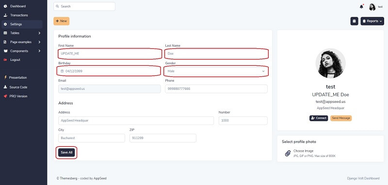

# Django User Profile

Django Sample project that allows registered users to edit their profile outside of the admin module. Django User Profile is provided on top of [Django Volt](https://github.com/app-generator/django-dashboard-volt) -  Features:&#x20;

* UI Kit: [Volt Bootstrap 5](https://themesberg.com/product/admin-dashboard/volt-bootstrap-5-dashboard) by **Themesberg**
* UI-Ready App, SQLite Database, Django Native ORM
* Session-Based Authentication, Forms validation
* Editable user profile: Name, Surname, Email, Phone, and address
* User Profile Page:  `settings.html`

> Links

* [Django User Profile ](https://django-user-profile.appseed-srv1.com/) - LIVE deployment
* [Django User Profile](https://github.com/app-generator/django-user-profile) - Sample Source Code
* Support via [Github](https://github.com/app-generator/django-user-profile/issues) (issues tracker) and LIVE on [Discord](https://discord.gg/fZC6hup).




### How to use the app

To compile and execute the project in a local environment the workstation must have a few software tools already installed:&#x20;

* [GIT](https://git-scm.com/) - command line versioning tool used to clone the sources&#x20;
* [Python3](https://www.python.org/) - the language used to code the project &#x20;

**Check GIT is installed**

```
$ git -v
git version 2.28.0.windows.1 <-- All Good
```

**Check Python is installed**

```
python --version
Python 3.8.4 <-- All Good
```

Once we have this minimal toolchain properly installed and accessible via a terminal window we can move forward and compile the code.

**Step #1 - Clone/download sources** from the public [repository ](https://github.com/app-generator/django-user-profile)

```
$ git clone https://github.com/app-generator/django-user-profile.git
$ cd django-user-profile
```

**Step #2 - Install modules** using a Virtual Environment

```
$ virtualenv env
$ source env/bin/activate
$
$ pip3 install -r requirements.txt
```

**Step #3 - Create SQLite Database and tables**

```
$ python manage.py makemigrations
$ python manage.py migrate
```


### Codebase Structure

```
< PROJECT ROOT >
   |
   |-- core/              # Implements app logic and serve the static assets
   |    |-- settings.py   # Django app bootstrapper
   |    |-- static/
   |    |-- templates/    # Templates used to render pages
   |
   |-- authentication/    # Handles auth routes (login and register)
   |    |-- urls.py       # Define authentication routes  
   |    |-- forms.py      # Define auth forms  
   |
   |-- app/               # A simple app that serve HTML files
   |    |-- views.py      # Serve HTML pages for authenticated users
   |    |-- urls.py       # Define some super simple routes  
   |
   |-- customers/         # Handles the profile edit     <-------- NEW
   |    |-- __init__.py   # Defines App init             <-------- NEW
   |    |-- admin.py      # Defines App admin            <-------- NEW
   |    |-- apps.py       # Defines App apps             <-------- NEW
   |    |-- forms.py      # Defines App forms            <-------- NEW
   |    |-- models.py     # Defines App models           <-------- NEW
   |    |-- signals.py    # Defines App signals          <-------- NEW
   |    |-- tests.py      # Defines App tests            <-------- NEW
   |    |-- urls.py       # Defines App routes           <-------- NEW
   |    |-- views.py      # Defines App views            <-------- NEW
   |
   |-- requirements.txt   # Development modules - SQLite storage
   |-- .env               # Inject Configuration via Environment
   |-- manage.py          # Start the app - Django default start script
   |
   |-- ***********************************
```


> The bootstrap flow

* Django bootstrapper `manage.py` uses `core/settings.py` as the main configuration file
* `core/settings.py` loads the app magic from `.env` file
* Redirect the guest users to Login page
* Unlock the pages served by _app_ node for authenticated users

### User Profile Feature

This section describes the coding process for this feature that allows authenticated users to update their profiles. By accessing the `settings.html` page, registered users can update their own profile: name, surname, phone number, city name, ZIP code, ..etc.

**The `customers` app:**

This module will manage the user profile information by defining a new model, form, and view. Authenticated users can also upload their `avatar`.

**The `Profile` model:**

`customers/models.py`: &#x20;

```python
class Profile(models.Model):

    # Managed fields
    user     = models.OneToOneField(User, related_name="profile", on_delete=models.CASCADE)
    avatar   = models.ImageField(upload_to="customers/profiles/avatars/", null=True, blank=True)
    birthday = models.DateField(null=True, blank=True)
    gender   = models.PositiveSmallIntegerField(choices=GENDER_CHOICES, null=True, blank=True)
    phone    = models.CharField(max_length=32, null=True, blank=True)
    address  = models.CharField(max_length=255, null=True, blank=True)
    number   = models.CharField(max_length=32, null=True, blank=True)
    city     = models.CharField(max_length=50, null=True, blank=True)
    zip      = models.CharField(max_length=30, null=True, blank=True)
```

#### The `Profile` form

Create a related form to show inputs & store data. The `ProfileForm` will be defined in the `customers/forms.py` using a definition as below:

```python
from django import forms
from customers.models import Profile

class ProfileForm(forms.ModelForm):
    first_name = forms.CharField(max_length=255)
    last_name = forms.CharField(max_length=255)
    email = forms.EmailField()

    class Meta:
        model = Profile
        fields = '__all__'
        exclude = ['user']
```

#### The `Profile` routing

Activate the routing for `customers` app by edit the `customers/urls.py` file with the following code:

```python
from django.urls import path
from customers import views

urlpatterns = [
    path('profile/', views.ProfileView.as_view(), name='profile'),
]
```

&#x20;**Update `core/urls`** to include `customers` urls:

```python
from django.conf import settings
from django.contrib import admin
from django.conf.urls.static import static
from django.urls import path, include

urlpatterns = [
    path('admin/', admin.site.urls),  # Django admin route
    path('customers/', include("customers.urls")),  # Django customers route
    # ...
]

# to support and show media & static files in developer mode
if settings.DEVEL:
    urlpatterns += static(settings.MEDIA_URL, document_root=settings.MEDIA_ROOT)
    urlpatterns += static(settings.STATIC_URL, document_root=settings.STATIC_ROOT)
```


**Links & Resources**:

* [Django](https://www.djangoproject.com/) - official website
* More [Django Dashboards](https://appseed.us/admin-dashboards/django) provided by AppSeed
