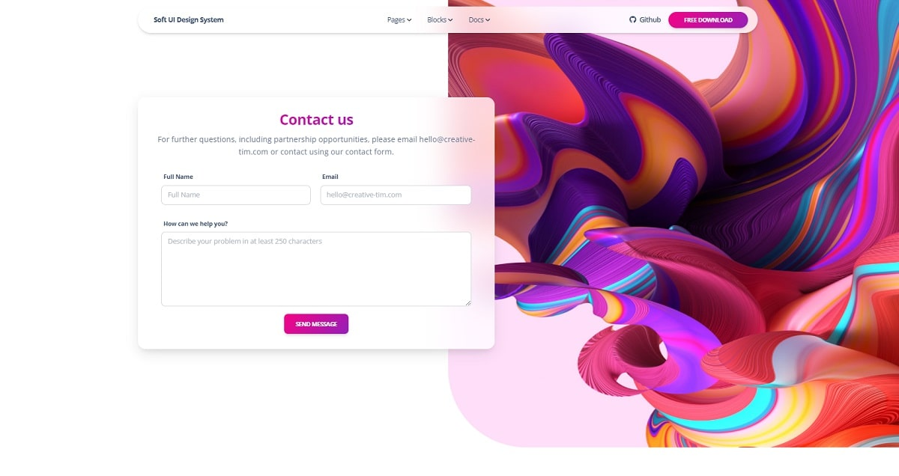

# Django v4 Release

In December 2021 [Django Version 4](https://docs.djangoproject.com/en/4.0/releases/4.0/) has been released with various upgrades to the framework, improvements, deprecations and also a few breaking changes.&#x20;

---

## Django 4.0 highlights

> `zoneinfo` default time zone

In this version the default `pytz` time zone has been migrated to `zoneinfo`&#x20;

<br />

> Template-based form rendering

`Forms`, `Formsets`, and `ErrorList` are now rendered using the template engine to enhance customization.

<br />

> RedisCache backend

Django v4 provides built-in support for caching with Redis via `redis-py` library

<br />

> scrypt password hasher

This new `password hasher` is more secure compared to PBKDF2 (the default hashing algorithm before v4)

---

> Deprecated Features

*   #### PostgreSQL v9.6 **support**&#x20;

    PostgreSQL v9.6 and earlier are not supported by Django v4.0. Django v4.0 will only support PostgreSQL ≥v10.
*   #### Oracle v12.2 and 18c

    Starting with Django 4, the Oracle version should be at least v19 or above. The Django team has officially removed support for Oracle versions 18c and earlier.

> Breaking Changes&#x20;

*   #### `CSRF_TRUSTED_ORIGINS` changes

    Values in the [`CSRF_TRUSTED_ORIGINS`](https://docs.djangoproject.com/en/4.0/ref/settings/#std:setting-CSRF\_TRUSTED\_ORIGINS) setting must include the scheme (e.g. `'http://'` or `'https://'`) instead of only the hostname. Also, this might be required in the project configuration.&#x20;

```python
# settings.py sample (partial content)
...
ALLOWED_HOSTS        = ['localhost', 'localhost:85', '127.0.0.1']
CSRF_TRUSTED_ORIGINS = ['http://localhost:85', 'http://127.0.0.1']
...
```


> AppSeed Free Starters upgraded to Django 4.x

* [Django Bootstrap 5 Volt](https://github.com/app-generator/django-volt-dashboard) - `open-source` starter&#x20;
* [Django Datta Able](https://appseed.us/admin-dashboards/django-datta-able) - `open-source` seed project
* [Django Soft UI Design](https://appseed.us/product/django-soft-ui-design-system) - Bootstrap 5 design&#x20;


