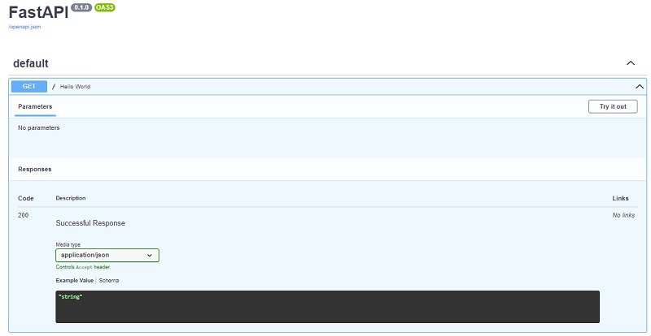

# Getting Started

[FastAPI](https://fastapi.tiangolo.com/) is an open-source high-performance, easy to learn web framework, at the same time fast to code, and production-ready.

* [FastAPI](https://fastapi.tiangolo.com/) - official website
* [FastAPI](https://github.com/tiangolo/fastapi) - source code (published on Github)
* [Learn FastAPI by coding](https://github.com/app-generator/fastapi-learn-by-coding) - sample project

As posted on the official website, FastAPI key features are listed below:

* **Very high performance** - thanks to [Starlette](https://www.starlette.io/) and [Pydantic](https://pydantic-docs.helpmanual.io/)
* **Fast-to-code** and intuitive
* **Robust** - provides interactive documentation `out-of-the-box`
* **Standards-based** - fully compatible with `OpenAPI` and `JSON Schema`

## Simple FastAPI Project

FastAPI requires Python 3.6 (or above) to execute successfully. For most of the Unix environments, Python3 might be already installed. To check the version, open a terminal and type:

```bash
$ python3 --version
```

If the version is 3.6 or above we can move forward and create a virtual environment for our first project powered by FastAPI.

> Create/activate a Virtual Environment (Unix systems)

```bash
$ virtualenv env
$ source env/bin/activate
```

> Create/activate a Virtual Environment for Windows Systems

```bash
$ # virtualenv env
$ # .\env\Scripts\activate
```

> Install FastAPI

```bash
$ pip install fastapi
$ pip install uvicorn
```

> Create `main.py`

```python
from fastapi import FastAPI

app = FastAPI()

@app.get("/")
async def root():
    return {"message": "Hello FastAPI"}
```

On line one, we are importing `FastAPI` which is a python class that provides functionality to our API.

On line three, we have created an instance `app` for our class, `FastAPI` which will be the main point of interaction for creating our API.

Line five creates a path operation `@app.get("/")` to instruct FastAPI that the function below will handle requests going to the `/` path and the `get` operation.

Other operations include;

* `@app.post()`
* `@app.put()`
* `@app.delete()`

Line six defines the operation path function. This is a python function that is called by FastAPI when it receives an operation path request.

Line seven returns the specified content.

Save the file and start the project using `uvicorn`

```bash
$ uvicorn main:app --reload
$ 
$ The project is LIVE - https://localhost:8000 
```

At this point we should be able to visit the API in the browser:

* API Root: `http://localhost:8000`
* OpenAPI Specs: `http://localhost:8000/docs`
* Redoc: `http://localhost:8000/redoc`



## Open-Source FastAPI Starters

GitHub has several FastApi starters/boilerplates that almost provide a non-code experience. These templates can be used as starting points for most FastAPI-based projects. Here is a list with a few actively supported FastAPI starters:

### [FastApi Template](https://github.com/s3rius/FastAPI-template)

This is a flexible general-purpose FastAPI template that allows you to choose between databases and ORMs. Supported databases include SQLAlchemy1.4, TortoiseORM, Piccolo, and Ormar.

Generator features include;

1. Different database support.
2. Different ORM support.
3. Optional Redis support.

### [FastApi Boilerplate](https://github.com/teamhide/fastapi-boilerplate)

This template employs the SQLAlchemy toolkit that provides threadsafe pool implementation. You won't be needing an ORM with this one. Here are some of its cool features;

1. Custom user class.
2. Top-level dependency.
3. Event dispatcher.

### [Cookiecutter FastAPI](https://github.com/arthurhenrique/cookiecutter-fastapi)

This is a user-friendly project since you do not need to fork it. All you need is the cookiecutter CLI. To generate the FastApi project, run;

```
cookiecutter gh:arthurhenrique/cookiecutter-fastapi
```

### [FastApi MVC](https://github.com/rszamszur/fastapi-mvc)

This is a developer productivity tool that makes it easier to create a FastAPI web framework by making assumptions on what we need to get started. Some core features include;

1. The project is based on MVC architectural pattern.
2. WSGI + ASGI production server.
3. Sphinx documentation and 100% unit test coverage.

### [FastAPI Starter](https://github.com/gaganpreet/fastapi-starter)

This is an easy-to-use project that relies on existing frameworks to provide an almost non-code experience. You will need Cookiecutter installed. To generate the project, run;

```
cookiecutter https://github.com/gaganpreet/fastapi-starter
```

Some core features include;

1. Modern admin interface using React-Admin
2. Integration tests with Cypress
3. Docker images for frontend and backend

## FastAPI Resources

* [The future of FastAPI and Pyndantic](https://tiangolo.medium.com/the-future-of-fastapi-and-pydantic-is-bright-2d1785a603a9)
* [You should start using FastAPI](https://towardsdatascience.com/you-should-start-using-fastapi-now-7efb280fec02)
* [Rise of Pydantic Stack](https://python.plainenglish.io/an-introduction-to-the-pydantic-stack-9e490d606c8d)
